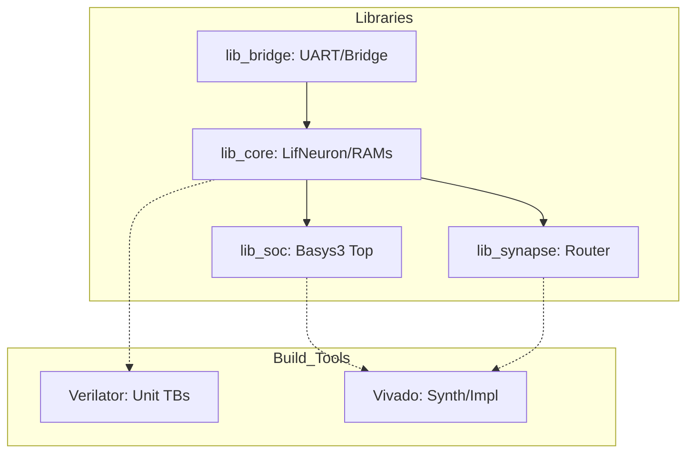
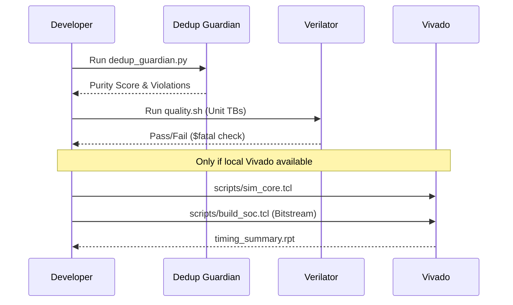

Relevant source files

The following files were used as context for generating this wiki page:

- [README.md](README.md)
- [AGENTS.md](AGENTS.md)
- [CLAUDE.md](CLAUDE.md)
- [scripts/dedup_guardian.py](scripts/dedup_guardian.py)
- [spikenaut-core-sv/mem/README.md](spikenaut-core-sv/mem/README.md)
- [scripts/quality.sh](scripts/quality.sh)
- [CHANGELOG.md](CHANGELOG.md)

# Home

Welcome to the `silicon-hdl` technical wiki. This project is a deduplicated, Vivado-ready SystemVerilog monorepo focusing on neuromorphic and Spiking Neural Network (SNN) FPGA primitives. It targets the Digilent Basys 3 development board (Artix-7 `xc7a35tcpg236-1`). The repository serves as a practice ground for hardware/software co-design, implementing real Register-Transfer Level (RTL) logic, Verilator-based Continuous Integration (CI), and experimental SNN demonstrations.

The monorepo is structured into four separately owned libraries with a strictly enforced dependency order and a single-source-of-truth rule for all modules. Quality is maintained through automated deduplication checks, unit testing via Verilator, and optional Vivado synthesis flows for bitstream generation.

Sources: [README.md:1-20](README.md#L1-L20), [CLAUDE.md:40-48](CLAUDE.md#L40-L48), [AGENTS.md:73-77](AGENTS.md#L73-L77)

## Repository Architecture

The project follows a modular library structure to ensure clear ownership and prevent logic duplication. The dependency flow is unidirectional: `lib_bridge` → `lib_core` → `lib_soc` / `lib_synapse`.

### Library Structure
| Library | Path | Responsibility |
|---|---|---|
| **lib_core** | `spikenaut-core-sv/` | Canonical SNN logic including neurons and memory controllers. |
| **lib_bridge** | `spikenaut-bridge-sv/` | Communication primitives such as UART and bridge modules. |
| **lib_soc** | `spikenaut-soc-sv/` | System-on-Chip wrappers and integration for the Basys 3 board. |
| **lib_synapse** | `synapse-link-hdl/` | AER (Address-Event Representation) routing and demo integrations. |

Sources: [README.md:22-38](README.md#L22-L38), [CLAUDE.md:49-55](CLAUDE.md#L49-L55)

### Dependency and Build Flow
The following diagram illustrates the hierarchical relationship between the libraries and the build process.

*The diagram shows how communication primitives and core SNN logic form the foundation for higher-level SoC and Synapse routing modules.*

Sources: [AGENTS.md:73-77](AGENTS.md#L73-L77), [CLAUDE.md:49-55](CLAUDE.md#L49-L55)

## Core Neuromorphic Components

The `lib_core` library contains the primary functional units for the SNN implementation. These modules are strictly located in `spikenaut-core-sv/rtl/` and are instantiated by other modules rather than being copied.

*  **LifNeuron**: Implements the Leaky Integrate-and-Fire neuron model.
*  **WeightRam**: Manages synaptic weights.
*  **NeuronParamRam**: Stores neuron-specific parameters like thresholds and leak rates.
*  **StdpController**: Handles Spike-Timing-Dependent Plasticity logic.

Sources: [README.md:40-47](README.md#L40-L47), [CLAUDE.md:49-55](CLAUDE.md#L49-L55)

### Memory and Parameters
Neuromorphic parameters are loaded into RAM modules using `$readmemh` from hex `.mem` files located in `spikenaut-core-sv/mem/`. The project currently uses the `merged_v2` profile, representing a 16-neuron export.

| Memory File | Target Module | Data Type | Description |
|---|---|---|---|
| `merged_v2_weights.mem` | `WeightRam` | Q8.8 Signed | 16x16 hidden layer weights. |
| `merged_v2_thresholds.mem` | `NeuronParamRam` | Q8.8 Hex | Per-neuron firing thresholds. |
| `merged_v2_decay.mem` | `NeuronParamRam` | Q8.8 Hex | Per-neuron leak/decay rates. |

Sources: [spikenaut-core-sv/mem/README.md:5-20](spikenaut-core-sv/mem/README.md#L5-L20)

## Quality Assurance & Verification

The project employs a multi-tiered verification strategy to ensure RTL correctness and architectural purity.

### Deduplication Guardian
To maintain the "Single Source of Truth," a custom script `scripts/dedup_guardian.py` is executed during CI. It scans for duplicate module definitions and flags near-duplicates using similarity thresholds.

*  **Strict Violations**: Fails if a module name is defined in multiple files.
*  **Near-Duplicates**: Uses `difflib` to report modules that are highly similar (default threshold 0.85), suggesting alignment with canonical sources.
*  **Purity Score**: A metric calculated based on the number of violations and near-duplicates found in the tree.

Sources: [scripts/dedup_guardian.py:12-25](scripts/dedup_guardian.py#L12-L25), [CHANGELOG.md:34-39](CHANGELOG.md#L34-L39)

### Build and Simulation Flow
The development cycle prioritizes fast iteration with Verilator before proceeding to Vivado for hardware implementation.

*The sequence illustrates the local development workflow from code purity checks to hardware synthesis.*

Sources: [AGENTS.md:12-28](AGENTS.md#L12-L28), [scripts/quality.sh:47-80](scripts/quality.sh#L47-L80)

## Development Guidelines

*  **Licensing**: Every source file must include the SPDX header: `SPDX-License-Identifier: MIT OR Apache-2.0`.
*  **Coding Standards**: Testbenches should drive/sample stimulus on the `negedge clk` to avoid race conditions with `posedge`-triggered logic.
*  **Issue Tracking**: This project uses `bd` (beads) for canonical issue tracking. Avoid using standard markdown TODOs within the codebase.
*  **Module Naming**: Top-level wrappers for different integrations must have distinct names (e.g., `spikenaut_soc_basys3_top` vs `synapse_demo_basys3_top`) to satisfy the Deduplication Guardian.

Sources: [AGENTS.md:79-99](AGENTS.md#L79-L99), [CLAUDE.md:33-35](CLAUDE.md#L33-L35)

## Summary
`silicon-hdl` provides a structured environment for SNN FPGA development. By enforcing strict module ownership and utilizing a tiered verification pipeline—ranging from Python-based linting to Verilator simulation and Vivado synthesis—the project ensures that neuromorphic primitives remain modular and reusable across different SoC integrations.
