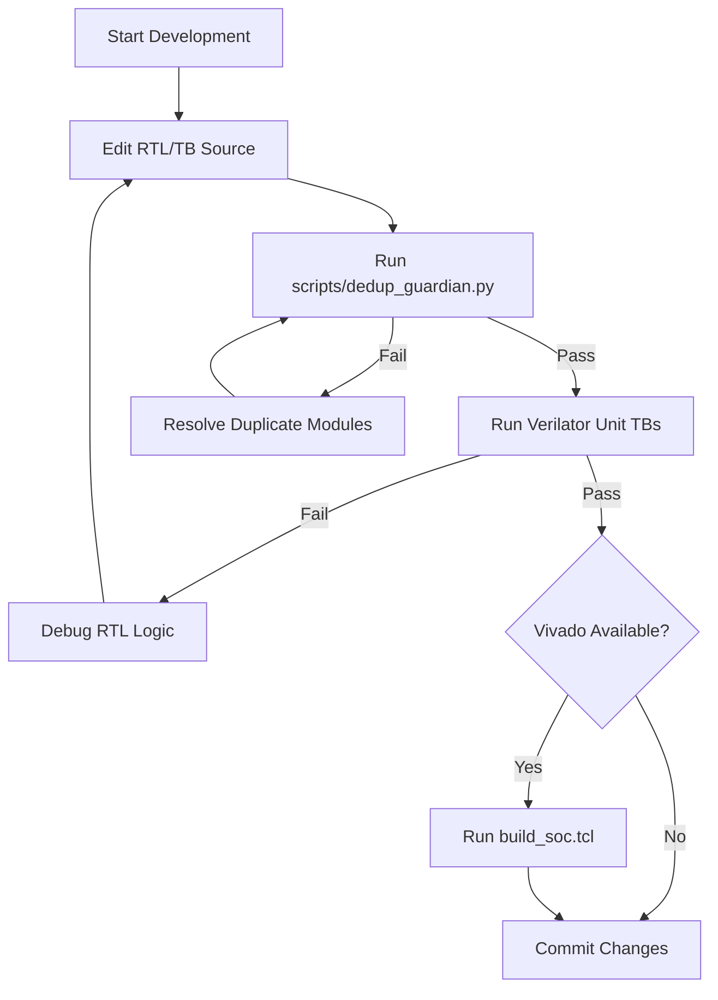
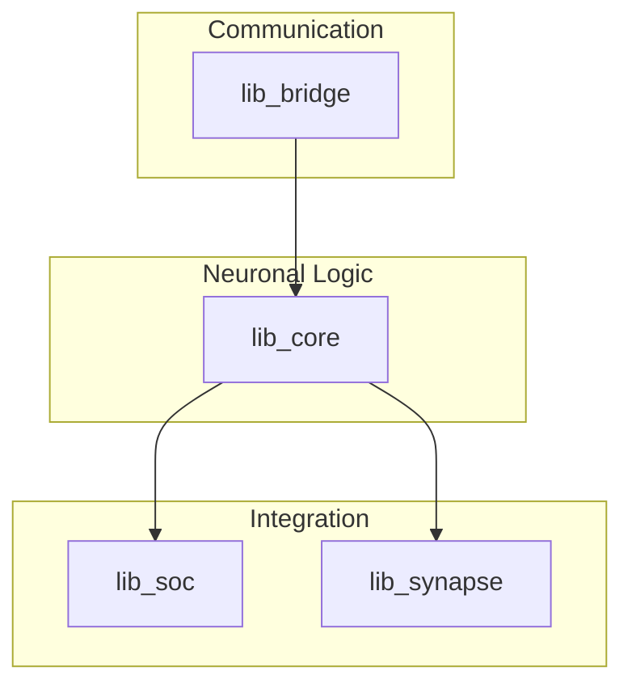

<details>
<summary>Relevant source files</summary>

The following files were used as context for generating this wiki page:

- [README.md](README.md)
- [AGENTS.md](AGENTS.md)
- [CLAUDE.md](CLAUDE.md)
- [scripts/quality.sh](scripts/quality.sh)
- [requirements-dev.txt](requirements-dev.txt)
- [spikenaut-core-sv/mem/README.md](spikenaut-core-sv/mem/README.md)
</details>

# Getting Started & Setup

Silicon-hdl is a deduplicated, Vivado-ready SystemVerilog monorepo designed for neuromorphic and Spiking Neural Network (SNN) FPGA primitives. It primarily targets the Digilent Basys 3 (Artix-7) development board. The project is structured as a collection of four distinct libraries with a strict dependency order: `lib_bridge` → `lib_core` → `lib_soc` / `lib_synapse`. Sources: [README.md:1-5](README.md#L1-L5), [CLAUDE.md:37-43](CLAUDE.md#L37-L43)

The development environment emphasizes a "free-stack" approach, prioritizing Verilator for fast Register-Transfer Level (RTL) simulation and iteration while reserving Xilinx Vivado for synthesis, implementation, and bitstream generation. A core component of the workflow is the "Deduplication Guardian," which enforces a single-source-of-truth policy to prevent module duplication across the repository. Sources: [AGENTS.md:12-16](AGENTS.md#L12-L16), [CLAUDE.md:44-50](CLAUDE.md#L44-L50)

## Environment Prerequisites

To set up the development environment, specific hardware and software tools are required depending on whether the user is performing simulation or full hardware synthesis.

### Toolchain Requirements
| Tool | Purpose | Requirement Level |
|---|---|---|
| **Verilator** | Fast RTL simulation of unit testbenches | Mandatory for local iteration |
| **Python 3** | Running the Deduplication Guardian and helper scripts | Mandatory |
| **Vivado** | Synthesis, implementation, and bitstream generation | Optional (Required for FPGA deployment) |
| **Basys 3** | Target hardware (Artix-7 `xc7a35tcpg236-1`) | Optional (Target platform) |

Sources: [CLAUDE.md:25-30](CLAUDE.md#L25-L30), [README.md:5-7](README.md#L5-L7), [AGENTS.md:12-16](AGENTS.md#L12-L16)

### Python Dependencies
For local development and running the quality checks, install the requirements provided in the development text file:

```bash
pip install -r requirements-dev.txt
```

Sources: [requirements-dev.txt:3-5](requirements-dev.txt#L3-L5)

## Core Development Workflow

The project utilizes a structured quality control flow. Developers are encouraged to use the `quality.sh` script to validate changes against the Deduplication Guardian and Verilator testbenches.

### Quality Validation Flow
The following diagram illustrates the standard local validation process:



The workflow ensures that code purity is maintained via the Guardian before proceeding to functional simulation and synthesis. Sources: [scripts/quality.sh:10-20](scripts/quality.sh#L10-L20), [AGENTS.md:12-18](AGENTS.md#L12-L18)

## Project Architecture & Libraries

The monorepo is organized into four libraries. Developers must adhere to the module ownership rules, ensuring each module is defined only in its canonical location. Sources: [README.md:21-35](README.md#L21-L35), [CLAUDE.md:37-44](CLAUDE.md#L37-L44)

| Library | Path | Canonical Modules |
|---|---|---|
| **lib_core** | `spikenaut-core-sv/rtl` | `LifNeuron`, `WeightRam`, `NeuronParamRam`, `StdpController` |
| **lib_bridge** | `spikenaut-bridge-sv/rtl` | `UartRx`, `UartTx`, `SiliconBridge` |
| **lib_soc** | `spikenaut-soc-sv/rtl` | `spikenaut_soc_basys3_top` |
| **lib_synapse** | `synapse-link-hdl/src` | `SynapseRouter`, `synapse_demo_basys3_top` |

Sources: [README.md:38-51](README.md#L38-L51), [CLAUDE.md:46-53](CLAUDE.md#L46-L53)

### Dependency Hierarchy



Compiling the project requires following this dependency direction to ensure all module references are resolved correctly. Sources: [AGENTS.md:68-70](AGENTS.md#L68-L70), [CLAUDE.md:40-43](CLAUDE.md#L40-L43)

## Simulation and Build Commands

### Verilator Simulation
To run unit testbenches using Verilator, use the following flags to ensure compatibility with SystemVerilog timing and width expansion:

```bash
verilator --binary --timing -Wno-WIDTHEXPAND -Wno-DECLFILENAME -Wno-TIMESCALEMOD \
  --top-module tb_LifNeuron \
  -Ispikenaut-core-sv/rtl \
  spikenaut-core-sv/rtl/LifNeuron.sv \
  spikenaut-core-sv/tb/tb_LifNeuron.sv
```

Sources: [AGENTS.md:32-40](AGENTS.md#L32-L40)

### Vivado Build
When Xilinx Vivado is available, it can be used for batch-mode simulation and synthesis:

```bash
# Core unit simulation
vivado -mode batch -source scripts/sim_core.tcl

# SoC synthesis and bitstream generation
vivado -mode batch -source scripts/build_soc.tcl
```

Sources: [AGENTS.md:58-61](AGENTS.md#L58-L61), [README.md:56-62](README.md#L56-L62)

## Memory Initialization Data
The SNN components utilize hex `.mem` files for Block RAM (BRAM) initialization via `$readmemh`. These files are located in `spikenaut-core-sv/mem/`.

| Image File | Target Instance | Meaning |
|---|---|---|
| `merged_v2_thresholds.mem` | `u_npram_threshold` | Neuron firing thresholds |
| `merged_v2_decay.mem` | `u_npram_leak` | Leak/decay rates |
| `merged_v2_weights.mem` | `u_wram` | 16x16 hidden layer weights |

Sources: [spikenaut-core-sv/mem/README.md:8-13](spikenaut-core-sv/mem/README.md#L8-L13), [spikenaut-core-sv/mem/README.md:36-41](spikenaut-core-sv/mem/README.md#L36-L41)

## Deduplication Guardian
The project enforces a strict single-source-of-truth rule. The `dedup_guardian.py` script checks for multiple definitions of the same module name. Sources: [README.md:65-72](README.md#L65-L72), [CLAUDE.md:62-67](CLAUDE.md#L62-L67)

**Usage:**

```bash
python scripts/dedup_guardian.py            # Strict check for CI
python scripts/dedup_guardian.py --radar    # Near-duplicate report (Dupe Radar)
```

Sources: [AGENTS.md:62-65](AGENTS.md#L62-L65)

## Conclusion
Setting up the `silicon-hdl` environment requires a balance between lightweight Verilator-based simulation and the full Vivado-based FPGA synthesis flow. By adhering to the library dependency hierarchy and utilizing the Deduplication Guardian, developers can maintain the architectural integrity of the neuromorphic primitives. Sources: [README.md:10-15](README.md#L10-L15), [CLAUDE.md:12-16](CLAUDE.md#L12-L16)
