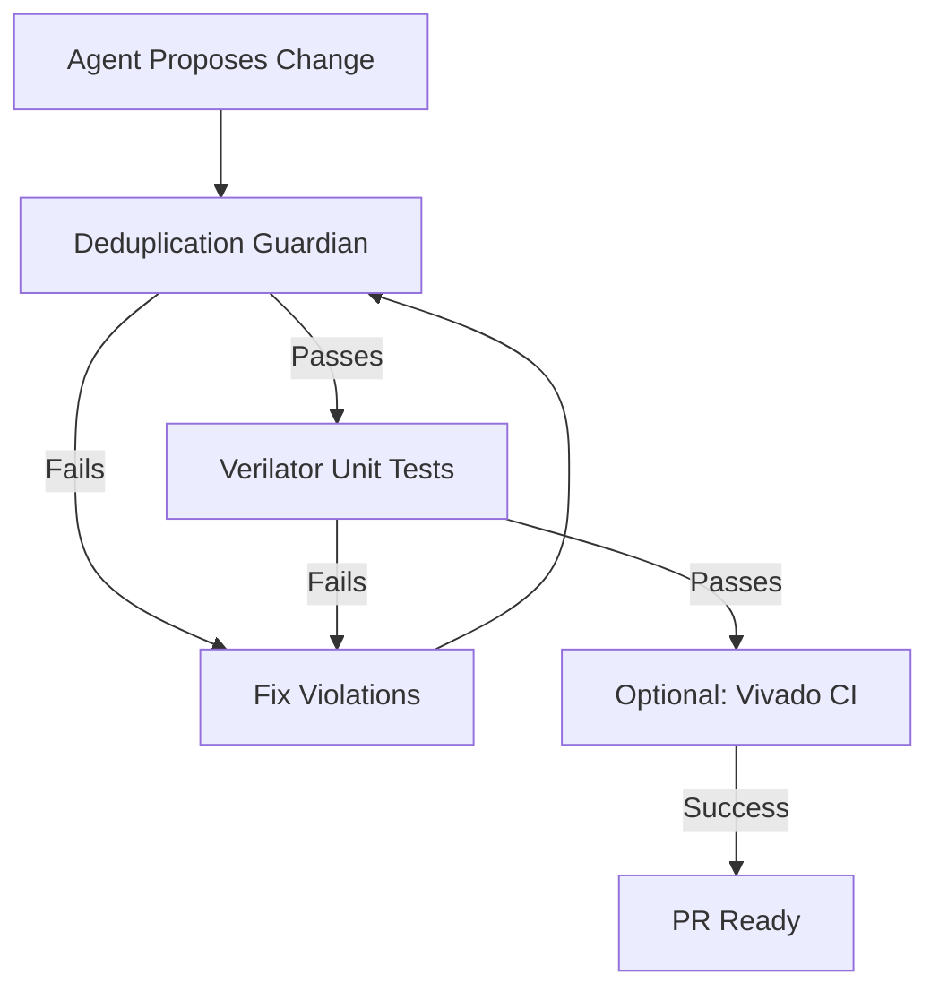
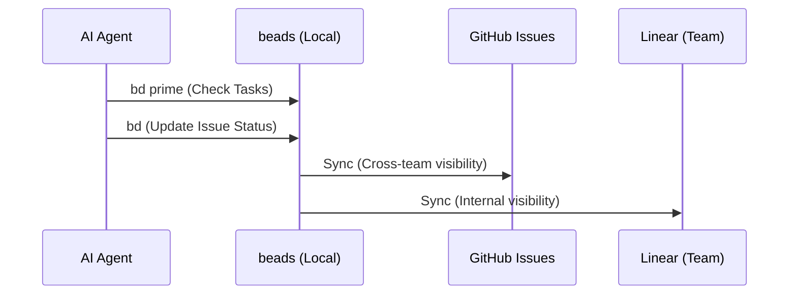

<details>
<summary>Relevant source files</summary>

The following files were used as context for generating this wiki page:

- [CLAUDE.md](CLAUDE.md)
- [AGENTS.md](AGENTS.md)
- [README.md](README.md)
- [scripts/dedup_guardian.py](scripts/dedup_guardian.py)
- [scripts/quality.sh](scripts/quality.sh)
- [CHANGELOG.md](CHANGELOG.md)
</details>

# AI & Agent Workflows

AI and Agent workflows in the `silicon-hdl` repository are designed to support hardware/software co-design through heavily automated processes. As the project serves as a practice ground for neuromorphic FPGA primitives, it relies on AI coding agents to maintain consistency, debug RTL logic, and enforce architectural rules such as the single-source-of-truth for modules.

The primary goal of these workflows is to provide a "free-stack" quality environment where agents can iterate rapidly using Verilator for simulation while maintaining strict repository hygiene via automated guardians and issue tracking.

Sources: [README.md:9-15](README.md#L9-L15), [CLAUDE.md:14-19](CLAUDE.md#L14-L19), [AGENTS.md:7-12](AGENTS.md#L7-L12)

## Agent Identity and Boundaries

The project defines specific personas and operational boundaries for AI agents (specifically Claude Code) to ensure the integrity of the SystemVerilog monorepo. Agents are instructed to act as careful hardware/software co-design assistants, prioritizing the smallest safe changes over large-scale rewrites of library ownership.

### Core Guidelines for Agents
- **Module Ownership:** Agents must not clone RTL modules. New logic requires unique module names, while existing logic must be instantiated from the canonical source.
- **Tool Preference:** Agents should prefer Verilator for fast iteration and local testing, reserving Vivado for final synthesis and bitstream generation.
- **Task Tracking:** Agents are restricted to using `bd` (beads) for issue tracking rather than internal TODO lists or markdown task boards.
- **Quality Gates:** The Deduplication Guardian must never be weakened without an explicit project decision.

Sources: [CLAUDE.md:14-34](CLAUDE.md#L14-L34), [AGENTS.md:103-112](AGENTS.md#L103-L112)

## Automated Quality Assurance Workflows

The workflow for AI agents involves a "Local free-stack quality" check, which aggregates strict module verification and unit testing. This is executed via `scripts/quality.sh`.



*The diagram above illustrates the multi-stage validation flow that agents must pass before code is considered stable.*

### The Deduplication Guardian
A central component of the agent workflow is the `dedup_guardian.py` script. It enforces the "Single Source of Truth" rule by scanning SystemVerilog files for registered module declarations and comparing them against canonical headers.

| Feature | Description | File/Tool |
|---|---|---|
| **Strict Check** | Fails if a `module Name` appears in more than one file. | `dedup_guardian.py` |
| **Dupe Radar** | Reports near-duplicates using similarity thresholds (default 0.85). | `dedup_guardian.py --radar` |
| **Purity Score** | Calculates a percentage based on violations and near-duplicates. | `scripts/dedup_guardian.py` |

Sources: [scripts/dedup_guardian.py:16-32](scripts/dedup_guardian.py#L16-L32), [CHANGELOG.md:41-47](CHANGELOG.md#L41-L47), [AGENTS.md:93-98](AGENTS.md#L93-L98)

## Iterative Development Loop

Agents follow a specific sequence for simulation and testing to minimize build time and artifact conflicts.

### Verilator Simulation Pattern
For core unit testbenches, agents are instructed to follow a specific compilation pattern that isolates build artifacts.

```bash
# Clean artifact isolation
rm -rf obj_dir
verilator --binary --timing -Wno-WIDTHEXPAND -Wno-DECLFILENAME -Wno-TIMESCALEMOD \
  --top-module tb_LifNeuron \
  -Ispikenaut-core-sv/rtl \
  spikenaut-core-sv/rtl/LifNeuron.sv \
  spikenaut-core-sv/tb/tb_LifNeuron.sv
./obj_dir/Vtb_LifNeuron
```

Sources: [AGENTS.md:36-47](AGENTS.md#L36-L47), [scripts/quality.sh:65-79](scripts/quality.sh#L65-L79)

### Vivado CI Integration
While agents prefer Verilator, a self-hosted Vivado CI workflow exists for final validation. This workflow is triggered by pull requests and specifically excludes fork PRs from running on self-hosted runners unless approved, mitigating security risks associated with runner access.

Sources: [AGENTS.md:16-29](AGENTS.md#L16-L29)

## Issue and Task Tracking

The project strictly separates internal repository task management from external visibility. Agents must use the `bd` (beads) tool for their primary source of truth.



*Task management flow ensuring agents maintain the local `bd` store as the authoritative source.*

Sources: [AGENTS.md:116-124](AGENTS.md#L116-L124), [CLAUDE.md:31-31](CLAUDE.md#L31)

## Summary of Agent Tools

| Category | Tool | Command / Context |
|---|---|---|
| **Communication** | beads (`bd`) | Canonical issue tracking and command reference. |
| **Simulation** | Verilator | Fast unit testbench execution. |
| **Validation** | `dedup_guardian.py` | Enforcement of RTL module uniqueness and similarity reports. |
| **Synthesis** | Vivado | Bitstream generation and timing validation via `check_wns.py`. |
| **Orchestration** | `quality.sh` | Wrapper script for local quality gates. |

Sources: [CLAUDE.md:36-44](CLAUDE.md#L36-L44), [scripts/quality.sh:10-14](scripts/quality.sh#L10-L14), [AGENTS.md:116-118](AGENTS.md#L116-L118)
