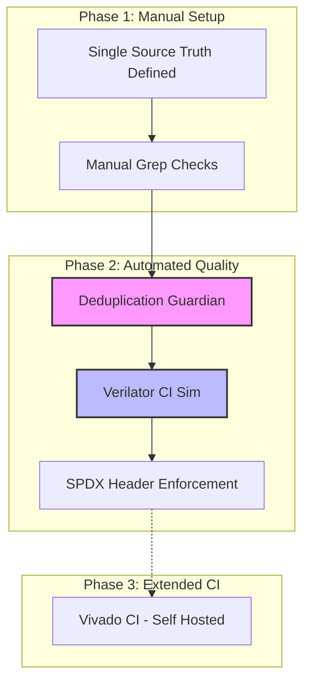

Relevant source files

The following files were used as context for generating this wiki page:

- [CHANGELOG.md](CHANGELOG.md)
- [README.md](README.md)
- [AGENTS.md](AGENTS.md)
- [CLAUDE.md](CLAUDE.md)
- [scripts/dedup_guardian.py](scripts/dedup_guardian.py)

# Changelog

The Changelog serves as the definitive record of all notable changes to the `silicon-hdl` repository. This project follows the [Keep a Changelog](https://keepachangelog.com/en/1.0.0/) format and adheres to [Semantic Versioning](https://semver.org/spec/v2.0.0.html) principles to ensure clear communication of updates, features, and fixes to developers and contributors.

Sources: [CHANGELOG.md:5-10](CHANGELOG.md#L5-L10)

## Project Versioning and Tracking

The project uses a structured approach to documenting progress, moving from unreleased features to stabilized releases. The primary focus of recent updates revolves around project infrastructure, licensing, and automated quality assurance measures such as CI/CD integration and deduplication enforcement.

Sources: [CHANGELOG.md:12-14](CHANGELOG.md#L12-L14), [CLAUDE.md:15-20](CLAUDE.md#L15-L20)

### Unreleased Changes

Recent development efforts have focused on establishing the core "single-source-of-truth" architecture and ensuring the repository is ready for wider adoption through licensing and automated testing.

#### Licensing and Documentation
The project has transitioned to a dual-licensing model to facilitate both research and commercial application.
*  **Dual Licensing**: MIT and Apache-2.0 licenses added (addresses #6).
*  **SPDX Headers**: Standardized `SPDX-License-Identifier: MIT OR Apache-2.0` headers added to all `.sv`, `.tcl`, `.xdc`, and documentation files.
*  **Documentation**: README updated with license badges and the initial CHANGELOG introduced.

Sources: [CHANGELOG.md:16-22](CHANGELOG.md#L16-L22), [README.md:104-114](README.md#L104-L114), [AGENTS.md:73-77](AGENTS.md#L73-L77)

#### Continuous Integration (CI) and Simulation
To support a "free-stack" development workflow without requiring expensive proprietary licenses, Verilator has been integrated into the GitHub Actions pipeline.
*  **Verilator CI**: Runs RTL unit testbenches (`tb_LifNeuron`, `tb_WeightRam`, `tb_NeuronParamRam`) on every push and pull request (addresses #9).
*  **Workflow**: Implementation of `.github/workflows/sim.yml` using GitHub-hosted runners to provide a no-cost verification path for core logic.

Sources: [CHANGELOG.md:23-28](CHANGELOG.md#L23-L28), [AGENTS.md:11-15](AGENTS.md#L11-L15)

#### Deduplication Guardian
The "Deduplication Guardian" was introduced to maintain the architectural integrity of the monorepo by preventing redundant module definitions across different library paths.
*  **Scripts**: Implementation of `scripts/dedup_guardian.py` and `.github/workflows/dedup-guardian.yml`.
*  **Enforcement**: Strict duplicate detection for registered modules and "Dupe Radar" for near-duplicate identification using similarity thresholds.

Sources: [CHANGELOG.md:29-33](CHANGELOG.md#L29-L33), [scripts/dedup_guardian.py:1-20](scripts/dedup_guardian.py#L1-L20)

## Infrastructure Evolution

The following diagram illustrates the evolution of project infrastructure from manual verification to the current automated quality gates documented in the changelog.

*The transition from manual checks to automated Guardian scripts and simulation-based CI as recorded in the development history.*

Sources: [CHANGELOG.md:16-33](CHANGELOG.md#L16-L33), [README.md:76-90](README.md#L76-L90)

## Release History Summary

| Feature Category | Implementation | Purpose |
| :--- | :--- | :--- |
| **Licensing** | MIT / Apache-2.0 Dual License | Legal clarity for research/commercial use |
| **Quality** | Deduplication Guardian | Enforces canonical single-source-of-truth |
| **Verification** | Verilator Integration | Free-stack simulation for core unit tests |
| **Documentation** | CHANGELOG.md | Track notable changes via Semantic Versioning |

Sources: [CHANGELOG.md:16-33](CHANGELOG.md#L16-L33), [CLAUDE.md:37-45](CLAUDE.md#L37-L45)

## Impact on RTL and Modules
The changelog notes that while significant infrastructure and licensing changes have occurred, there have been **no behavioral or interface changes** to the existing Register-Transfer Level (RTL) code or modules. The core logic remains stable as the surrounding ecosystem matures.

Sources: [CHANGELOG.md:35-37](CHANGELOG.md#L35-L37)

## Conclusion
The current state of the changelog reflects a project focusing on maturing its infrastructure and ensuring strict adherence to its "single-source-of-truth" philosophy. Through the introduction of the Deduplication Guardian and Verilator CI, `silicon-hdl` provides a reliable foundation for neuromorphic FPGA development while maintaining a transparent history of project evolution.
