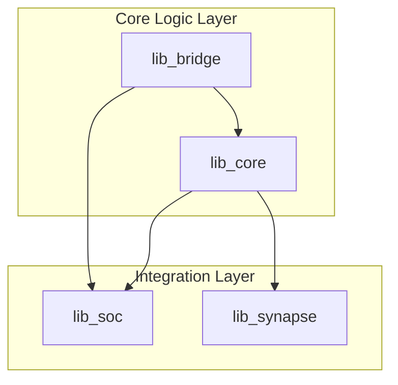
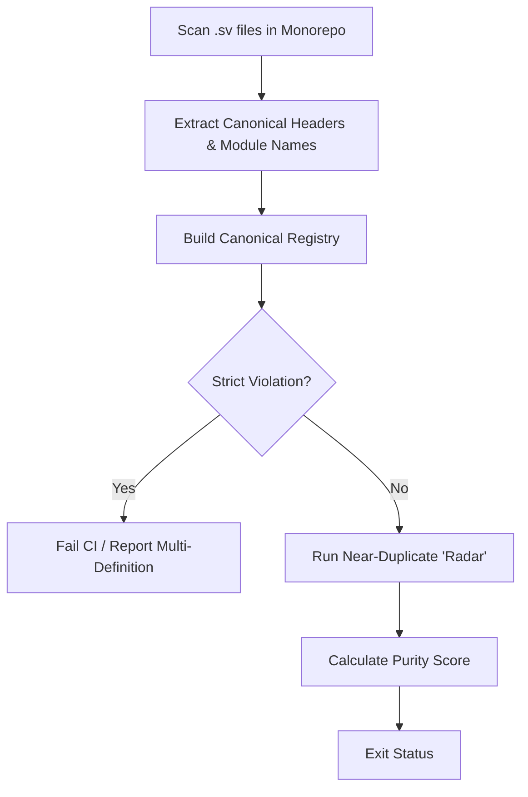

<details>
<summary>Relevant source files</summary>

The following files were used as context for generating this wiki page:

- [README.md](README.md)
- [AGENTS.md](AGENTS.md)
- [CLAUDE.md](CLAUDE.md)
- [scripts/dedup_guardian.py](scripts/dedup_guardian.py)
- [spikenaut-core-sv/mem/README.md](spikenaut-core-sv/mem/README.md)
- [scripts/quality.sh](scripts/quality.sh)
</details>

# Monorepo Layout & Dependencies

The `silicon-hdl` repository is a deduplicated, Vivado-ready monorepo focusing on SystemVerilog primitives for neuromorphic and Spiking Neural Network (SNN) hardware. It targets the Digilent Basys 3 FPGA (Artix-7) and enforces a strict single-source-of-truth architecture across its constituent libraries.
Sources: [README.md:1-12](README.md#L1-L12), [CLAUDE.md:54-58](CLAUDE.md#L54-L58)

The project is structured to ensure that core logic is never duplicated. Instead, higher-level SoC and demonstration wrappers instantiate canonical modules from specialized library directories. This hierarchy is maintained through a combination of strict directory conventions and automated enforcement tools like the Deduplication Guardian.
Sources: [CLAUDE.md:18-24](CLAUDE.md#L18-L24), [AGENTS.md:92-96](AGENTS.md#L92-L96)

## Directory Structure and Library Ownership

The monorepo is organized into four separately owned libraries with a fixed dependency order. Each library serves a specific architectural role, ranging from low-level communication to top-level hardware integration.

| Library | Path | Role | Key Components |
| :--- | :--- | :--- | :--- |
| `lib_core` | `spikenaut-core-sv/` | Canonical SNN logic | `LifNeuron`, `WeightRam`, `StdpController` |
| `lib_bridge` | `spikenaut-bridge-sv/` | Communication primitives | `UartRx`, `UartTx`, `SiliconBridge` |
| `lib_soc` | `spikenaut-soc-sv/` | SoC wrappers for Basys 3 | `spikenaut_soc_basys3_top` |
| `lib_synapse` | `synapse-link-hdl/` | AER routing and demo tops | `SynapseRouter`, `synapse_demo_basys3_top` |

Sources: [README.md:14-30](README.md#L14-L30), [CLAUDE.md:54-68](CLAUDE.md#L54-L68)

### Dependency Hierarchy
Compile order is critical in this monorepo and follows a one-way dependency flow. Lower-level libraries must be available for higher-level wrappers to instantiate their modules.



The diagram shows the fixed dependency direction: communication and core primitives are required by the SoC and Synapse integration layers.
Sources: [CLAUDE.md:54-58](CLAUDE.md#L54-L58), [AGENTS.md:92-94](AGENTS.md#L92-L94)

## Canonical Module Registry

To maintain a "single source of truth," every primary RTL module is assigned a canonical location. Duplication of these modules in integration directories (like `spikenaut-soc-sv/rtl`) is strictly forbidden.
Sources: [CLAUDE.md:18-20](CLAUDE.md#L18-L20), [README.md:46-49](README.md#L46-L49)

| Module Name | Canonical Path |
| :--- | :--- |
| `LifNeuron` | `spikenaut-core-sv/rtl/LifNeuron.sv` |
| `WeightRam` | `spikenaut-core-sv/rtl/WeightRam.sv` |
| `NeuronParamRam` | `spikenaut-core-sv/rtl/NeuronParamRam.sv` |
| `StdpController` | `spikenaut-core-sv/rtl/StdpController.sv` |
| `UartRx` | `spikenaut-bridge-sv/rtl/UartRx.sv` |
| `UartTx` | `spikenaut-bridge-sv/rtl/UartTx.sv` |
| `SiliconBridge` | `spikenaut-bridge-sv/rtl/SiliconBridge.sv` |
| `SynapseRouter` | `synapse-link-hdl/src/SynapseRouter.sv` |

Sources: [README.md:33-44](README.md#L33-L44)

Each source file contains a header declaring its ownership:

```systemverilog
// SPDX-License-Identifier: MIT OR Apache-2.0
// LifNeuron.sv
// Canonical source: spikenaut-core-sv/rtl
```

Sources: [CLAUDE.md:70-74](CLAUDE.md#L70-L74)

## Dependency Enforcement: Deduplication Guardian

The project utilizes a custom Python script, the **Deduplication Guardian** (`scripts/dedup_guardian.py`), to enforce module uniqueness. This tool is integrated into the CI pipeline to fail Pull Requests that introduce duplicate module definitions.
Sources: [CLAUDE.md:76-79](CLAUDE.md#L76-L79), [scripts/dedup_guardian.py:1-20](scripts/dedup_guardian.py#L1-L20)

### Guardian Logic Flow
The Guardian scans specific focus areas and compares module declarations against the canonical headers.



The flow represents how the Guardian identifies strict violations (duplicate names) versus near-duplicates (similar code logic).
Sources: [scripts/dedup_guardian.py:44-120](scripts/dedup_guardian.py#L44-L120)

### Purity Score Calculation
The Guardian calculates a "Purity Score" based on violations:
*  **Strict Violations**: Deduct 20% per instance.
*  **Near-Duplicates**: Deduct 5% per instance (similarity > threshold, default 0.85).
Sources: [scripts/dedup_guardian.py:148-151](scripts/dedup_guardian.py#L148-L151)

## External Dependencies and Tooling

The monorepo relies on specific hardware and software dependencies for simulation and synthesis.

### Hardware Targets
*  **Target Device**: Xilinx Artix-7 (`xc7a35tcpg236-1`).
*  **Target Board**: Digilent Basys 3.
Sources: [CLAUDE.md:55-57](CLAUDE.md#L55-L57)

### Software Stack
| Tool | Usage | Dependency Type |
| :--- | :--- | :--- |
| **Verilator** | Fast RTL simulation of core testbenches (`tb_*`) | Local / CI (Free) |
| **Vivado** | Synthesis, implementation, and bitstream generation | Optional / Self-hosted CI |
| **Python 3** | Running `dedup_guardian.py` and quality scripts | Required |
| **Beads (bd)** | Canonical issue tracking | Workflow |

Sources: [CLAUDE.md:36-45](CLAUDE.md#L36-L45), [AGENTS.md:120-123](AGENTS.md#L120-L123)

### Build and Quality Scripts
Dependencies between scripts and RTL are managed through hardcoded file lists in TCL scripts to ensure correct compilation order within Vivado.
*  `scripts/quality.sh`: Entrypoint for local quality checks (Guardian + Verilator).
*  `scripts/build_soc.tcl`: Manages Vivado synthesis and implementation.
*  `scripts/sim_core.tcl`: Discovers core unit testbenches.
Sources: [AGENTS.md:75-88](AGENTS.md#L75-L88), [scripts/quality.sh:1-15](scripts/quality.sh#L1-L15)

## Memory and Data Dependencies

The SNN primitives depend on external `.mem` files for weight and parameter initialization via `$readmemh`. These files must be located relative to the repository root for consistency across different simulation environments.
Sources: [spikenaut-core-sv/mem/README.md:1-15](spikenaut-core-sv/mem/README.md#L1-L15)

| Memory Instance | Image File | Contents |
| :--- | :--- | :--- |
| `u_wram` | `merged_v2_weights.mem` | 16x16 hidden weights (Q8.8) |
| `u_npram_threshold` | `merged_v2_thresholds.mem` | Neuron thresholds |
| `u_npram_leak` | `merged_v2_decay.mem` | Leak / decay rates |

Sources: [spikenaut-core-sv/mem/README.md:29-37](spikenaut-core-sv/mem/README.md#L29-L37)

## Conclusion

The layout of the `silicon-hdl` monorepo is designed to facilitate hardware/software co-design by strictly separating canonical RTL primitives from their implementation wrappers. By enforcing a clear dependency direction (`lib_bridge` → `lib_core` → `lib_soc`) and utilizing the Deduplication Guardian, the project ensures architectural consistency and prevents the proliferation of redundant logic across the FPGA target platforms.
