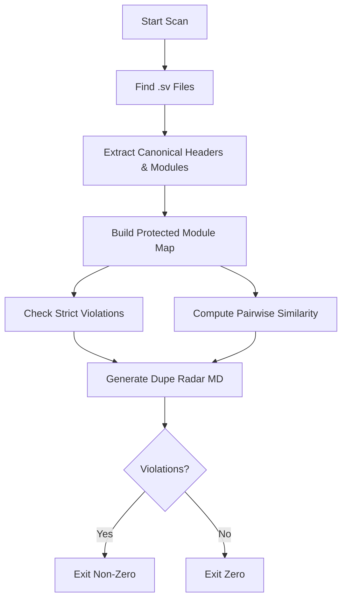
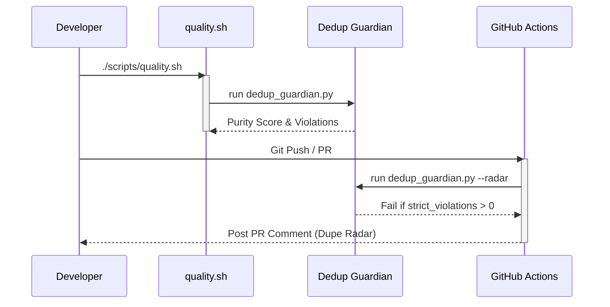

Relevant source files

The following files were used as context for generating this wiki page:

- [scripts/dedup_guardian.py](scripts/dedup_guardian.py)
- [tests/test_dedup_guardian.py](tests/test_dedup_guardian.py)
- [README.md](README.md)
- [CLAUDE.md](CLAUDE.md)
- [AGENTS.md](AGENTS.md)
- [CHANGELOG.md](CHANGELOG.md)
- [scripts/quality.sh](scripts/quality.sh)

# Deduplication Guardian Engine

The Deduplication Guardian Engine is a core quality assurance system within the `silicon-hdl` repository designed to enforce "single-source-of-truth" rules for SystemVerilog (SV) hardware modules. Its primary purpose is to ensure that registered RTL modules are defined in exactly one canonical location, preventing the proliferation of duplicate or near-duplicate logic across different libraries in the monorepo. Sources: [scripts/dedup_guardian.py:1-20](scripts/dedup_guardian.py#L1-L20), [README.md:82-88](README.md#L82-L88)

The engine operates as both a local CLI tool for developers and a CI enforcement gate. It scans the repository's focus areas—specifically `spikenaut-*` and `synapse-link-hdl` directories—to identify strict violations where a module name appears in multiple files, and provides a "Dupe Radar" report for near-duplicates using similarity scoring. Sources: [scripts/dedup_guardian.py:27-30](scripts/dedup_guardian.py#L27-L30), [CLAUDE.md:65-68](CLAUDE.md#L65-L68), [CHANGELOG.md:31-36](CHANGELOG.md#L31-L36)

## Architecture and Core Logic

The engine is implemented in Python and utilizes regular expressions to parse SystemVerilog files for specific metadata and module declarations. It operates in a three-phase pipeline: discovery, analysis, and reporting. Sources: [scripts/dedup_guardian.py:33-40](scripts/dedup_guardian.py#L33-L40), [scripts/dedup_guardian.py:130-137](scripts/dedup_guardian.py#L130-L137)

### Analysis Workflow
The diagram below illustrates the sequence of operations performed by the engine during a repository scan.

The workflow ensures that any module marked with a `Canonical source:` header is validated against its actual location in the file system. Sources: [scripts/dedup_guardian.py:43-85](scripts/dedup_guardian.py#L43-L85), [scripts/dedup_guardian.py:168-195](scripts/dedup_guardian.py#L168-L195)

### Extraction Logic
The engine looks for two specific patterns within `.sv` files:
1.  **Canonical Header**: Defined by the regex `r"^\s*//\s*Canonical source:\s*(.+?)\s*$"` to identify the intended owner of the logic.
2.  **Module Declaration**: Defined by the regex `r"^\s*module\s+(\w+)"` to find the actual hardware module name.

Sources: [scripts/dedup_guardian.py:33-36](scripts/dedup_guardian.py#L33-L36), [tests/test_dedup_guardian.py:23-45](tests/test_dedup_guardian.py#L23-L45)

## Key Components and Functions

The engine is composed of several high-level functions that manage the deduplication logic and similarity scoring.

### Repository Analysis Functions
| Function | Description |
|---|---|
| `find_sv_files` | Scans the root directory using `FOCUS_GLOBS` to identify target SystemVerilog files. |
| `build_protected_and_locations` | Builds a mapping of module names to their file paths and identifies "protected" modules (those with canonical headers). |
| `compute_similarity` | Uses `difflib.SequenceMatcher` to calculate a normalized similarity ratio between two file implementation texts. |
| `analyze_repository` | Orchestrates the scan and calculates the final **Purity Score**. |

Sources: [scripts/dedup_guardian.py:43-137](scripts/dedup_guardian.py#L43-L137), [tests/test_dedup_guardian.py:12-21](tests/test_dedup_guardian.py#L12-L21)

### Data Structures
The engine primarily uses standard Python collections to track findings:
- **`protected` (set)**: Contains names of modules that have declared a canonical source.
- **`locs` (defaultdict)**: A mapping of `module_name -> List[Path]` used to identify strict duplicates.
- **`near_dups` (list)**: A list of tuples containing file pairs, their similarity score, and a unified diff snippet.

Sources: [scripts/dedup_guardian.py:59-75](scripts/dedup_guardian.py#L59-L75), [scripts/dedup_guardian.py:112-127](scripts/dedup_guardian.py#L112-L127)

## Dupe Radar and Purity Score

The engine generates a human-readable report known as the **Dupe Radar**. This report categorizes findings into strict violations (which fail the build) and near-duplicates (which trigger warnings). Sources: [scripts/dedup_guardian.py:168-175](scripts/dedup_guardian.py#L168-L175), [AGENTS.md:90-95](AGENTS.md#L90-L95)

### Purity Score Calculation
The Purity Score is a metric representing the health of the repository's single-source-of-truth status. It starts at 100% and is reduced based on findings:
- **Strict Violation**: -20% per duplicate module name.
- **Near-Duplicate**: -5% per pair flagged for review.

Sources: [scripts/dedup_guardian.py:135](scripts/dedup_guardian.py#L135), [tests/test_dedup_guardian.py:65-72](tests/test_dedup_guardian.py#L65-L72)

### Detection Thresholds
Near-duplicate detection is configurable via the CLI.
| Parameter | Default | Description |
|---|---|---|
| `--threshold` | 0.85 | The similarity ratio (0.0 to 1.0) above which two files are flagged as near-duplicates. |
| `--radar` | None | Optional file path to write the markdown report (e.g., `radar.md`). |

Sources: [scripts/dedup_guardian.py:20-25](scripts/dedup_guardian.py#L20-L25), [scripts/dedup_guardian.py:198-202](scripts/dedup_guardian.py#L198-L202)

## Integration and Enforcement

The Guardian is integrated into the project's quality lifecycle at multiple levels:

1.  **Local Execution**: Developers run `python scripts/dedup_guardian.py` manually before committing changes. Sources: [AGENTS.md:90-95](AGENTS.md#L90-L95)
2.  **Quality Script**: It is the first check performed by the `scripts/quality.sh` entrypoint. Sources: [scripts/quality.sh:42-47](scripts/quality.sh#L42-L47)
3.  **Continuous Integration**: Automated via `.github/workflows/dedup-guardian.yml`, which fails PRs that introduce strict duplicates. Sources: [CLAUDE.md:65-68](CLAUDE.md#L65-L68), [CHANGELOG.md:31-36](CHANGELOG.md#L31-L36)

Sources: [scripts/quality.sh:42-47](scripts/quality.sh#L42-L47), [CHANGELOG.md:31-36](CHANGELOG.md#L31-L36), [CLAUDE.md:65-68](CLAUDE.md#L65-L68)

## Conclusion
The Deduplication Guardian Engine serves as a critical linting tool for the `silicon-hdl` monorepo. By enforcing strict module ownership and providing visibility into near-duplicate code, it maintains the integrity of the project's library structure (`lib_bridge`, `lib_core`, `lib_soc`, `lib_synapse`) and prevents the accumulation of technical debt associated with redundant RTL definitions. Sources: [CLAUDE.md:55-63](CLAUDE.md#L55-L63), [README.md:43-56](README.md#L43-L56)
