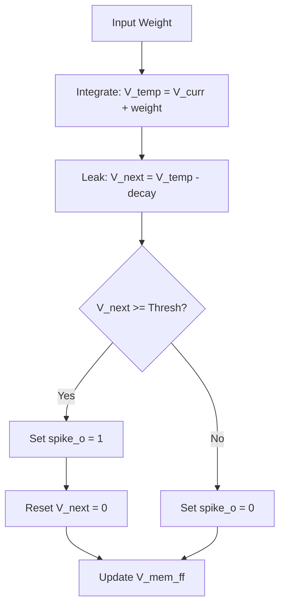
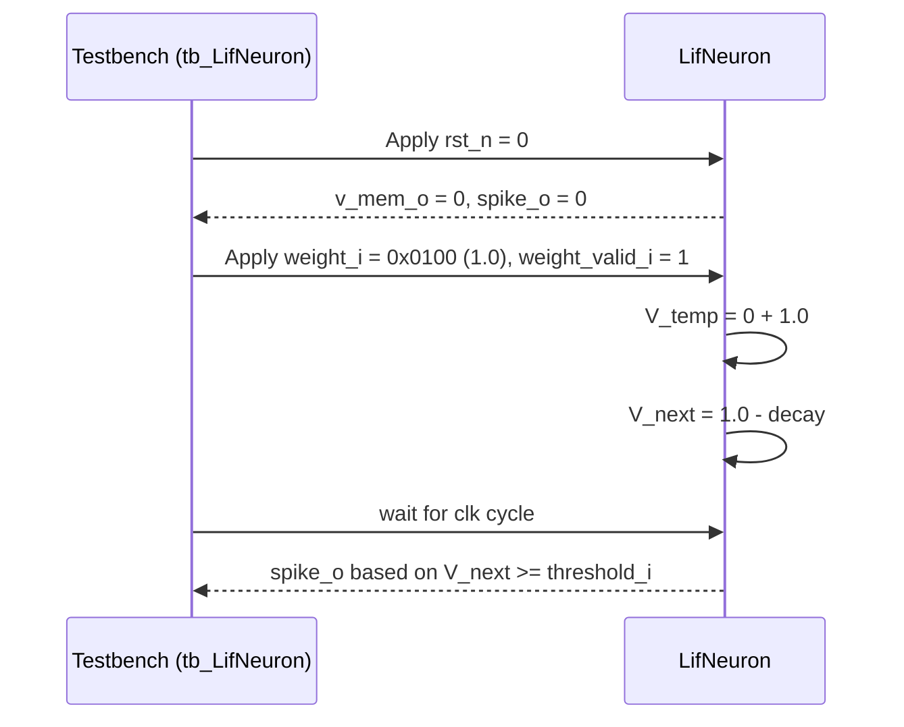

Relevant source files

The following files were used as context for generating this wiki page:

- [spikenaut-core-sv/rtl/LifNeuron.sv](spikenaut-core-sv/rtl/LifNeuron.sv)
- [spikenaut-core-sv/tb/tb_LifNeuron.sv](spikenaut-core-sv/tb/tb_LifNeuron.sv)
- [README.md](README.md)
- [CLAUDE.md](CLAUDE.md)
- [AGENTS.md](AGENTS.md)
- [spikenaut-core-sv/mem/README.md](spikenaut-core-sv/mem/README.md)

# LifNeuron (Leaky Integrate-and-Fire)

The `LifNeuron` module is the canonical Spiking Neural Network (SNN) logic primitive within the `silicon-hdl` repository. It implements a standard Leaky Integrate-and-Fire mathematical model, serving as a core component of the `lib_core` library. The module is designed for FPGA deployment, specifically targeting the Digilent Basys 3 (Artix-7) platform.

This module works in conjunction with other core primitives such as `WeightRam`, `NeuronParamRam`, and `StdpController` to form the computational backbone of the Spikenaut SNN architecture. It handles membrane potential integration, leakage over time, and spike generation when reaching a defined threshold.

Sources: [README.md:12-19](README.md#L12-L19), [CLAUDE.md:46-52](CLAUDE.md#L46-L52), [spikenaut-core-sv/rtl/LifNeuron.sv](spikenaut-core-sv/rtl/LifNeuron.sv)

## Architecture and Logic

The `LifNeuron` operates as a synchronous digital circuit that processes incoming synaptic weights to update an internal membrane potential. The logic follows three primary phases: integration of inputs, application of a decay (leak) factor, and threshold evaluation to determine if an output spike should be triggered.

### Functional Flow

The following diagram illustrates the internal state transitions and data processing flow of the neuron logic:

The membrane potential updates occur on the positive edge of the clock signal, while resets are handled synchronously.

Sources: [spikenaut-core-sv/rtl/LifNeuron.sv](spikenaut-core-sv/rtl/LifNeuron.sv), [spikenaut-core-sv/tb/tb_LifNeuron.sv](spikenaut-core-sv/tb/tb_LifNeuron.sv)

### Data Representation
The system utilizes a **Q8.8 fixed-point format** for all neural parameters, including weights, thresholds, and decay rates. This format uses 16-bit words where 8 bits represent the integer portion and 8 bits represent the fractional portion.

| Parameter Type | Source | Bits | Description |
|---|---|---|---|
| Threshold | `merged_v2_thresholds.mem` | 16 (Q8.8) | Value required to trigger a spike |
| Decay Rate | `merged_v2_decay.mem` | 16 (Q8.8) | Amount subtracted from potential each cycle |
| Synaptic Weight | `merged_v2_weights.mem` | 16 (Q8.8) | Value added to potential upon input |

Sources: [spikenaut-core-sv/mem/README.md:1-25](spikenaut-core-sv/mem/README.md#L1-L25)

## Port Definitions and Configuration

The `LifNeuron` module provides a standard interface for integration into larger SoC structures like `spikenaut_soc_basys3_top`.

### IO Interface

| Port Name | Direction | Width | Description |
|---|---|---|---|
| `clk` | Input | 1 | System clock |
| `rst_n` | Input | 1 | Asynchronous active-low reset |
| `weight_i` | Input | 16 | Incoming synaptic weight (Q8.8) |
| `weight_valid_i` | Input | 1 | Indicates `weight_i` is valid for integration |
| `decay_i` | Input | 16 | Leak constant (Q8.8) |
| `threshold_i` | Input | 16 | Firing threshold (Q8.8) |
| `spike_o` | Output | 1 | High for one cycle when neuron fires |
| `v_mem_o` | Output | 16 | Current membrane potential (for debugging/monitoring) |

Sources: [spikenaut-core-sv/rtl/LifNeuron.sv](spikenaut-core-sv/rtl/LifNeuron.sv), [spikenaut-core-sv/tb/tb_LifNeuron.sv](spikenaut-core-sv/tb/tb_LifNeuron.sv)

## Verification and Testing

Validation of the `LifNeuron` logic is performed using Verilator and SystemVerilog testbenches. The testbench `tb_LifNeuron.sv` drives stimulus on the `negedge` of the clock to ensure clean sampling by the `posedge` triggered RTL logic.

### Simulation Sequence
The interaction between the testbench and the neuron module follows this sequence:

Sources: [AGENTS.md:46-52](AGENTS.md#L46-L52), [spikenaut-core-sv/tb/tb_LifNeuron.sv](spikenaut-core-sv/tb/tb_LifNeuron.sv)

### CI Enforcement
The `LifNeuron` module is subject to the **Deduplication Guardian**. This ensures that the module definition exists only in `spikenaut-core-sv/rtl/LifNeuron.sv`. Any attempt to duplicate the logic in other libraries like `lib_soc` or `lib_bridge` will trigger a CI failure.

Sources: [scripts/dedup_guardian.py:17-40](scripts/dedup_guardian.py#L17-L40), [CHANGELOG.md:27-33](CHANGELOG.md#L27-L33)

## Summary
`LifNeuron` provides the fundamental computational unit for the Spikenaut SNN core. By implementing the Leaky Integrate-and-Fire model in Q8.8 fixed-point math, it balances biological plausibility with FPGA resource efficiency. It is strictly maintained as a single-source-of-truth module within the `lib_core` library, verified through automated Verilator simulations and protected by the project's deduplication scripts.
