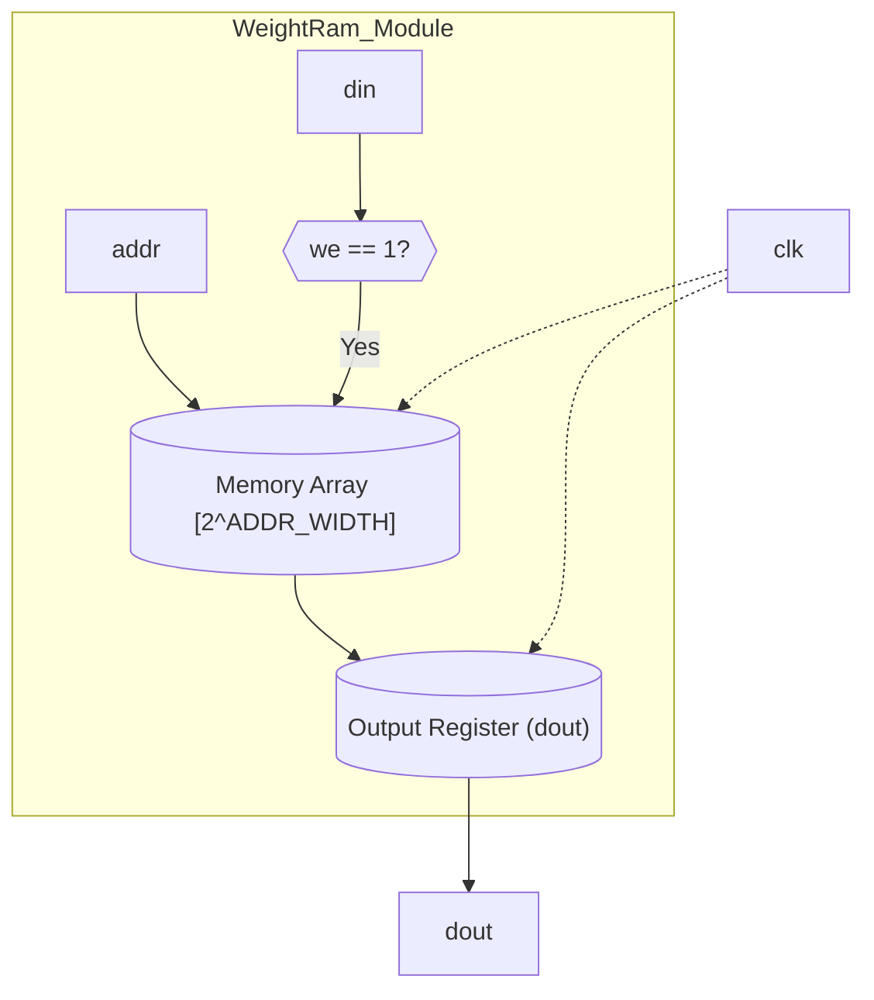
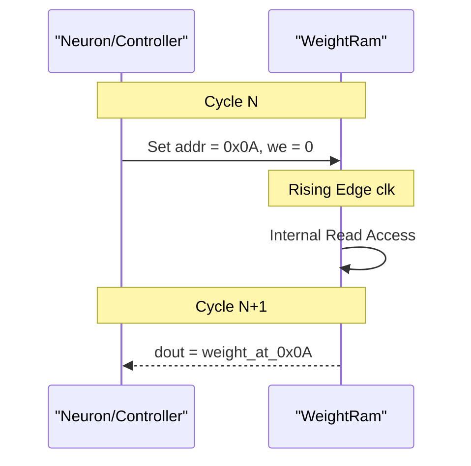

<details>
<summary>Relevant source files</summary>

The following files were used as context for generating this wiki page:

- [spikenaut-core-sv/rtl/WeightRam.sv](spikenaut-core-sv/rtl/WeightRam.sv)
- [spikenaut-core-sv/tb/tb_WeightRam.sv](spikenaut-core-sv/tb/tb_WeightRam.sv)
- [spikenaut-core-sv/mem/README.md](spikenaut-core-sv/mem/README.md)
- [README.md](README.md)
- [AGENTS.md](AGENTS.md)
- [scripts/build_soc.tcl](scripts/build_soc.tcl)
</details>

# WeightRam (Synaptic Weights)

The `WeightRam` module is a fundamental component of the `lib_core` library within the `silicon-hdl` project. It serves as the primary storage mechanism for synaptic weights used in neuromorphic computations, specifically for Spiking Neural Networks (SNN). The module is designed to be highly configurable, allowing for adjustable data widths and addressable memory depths to accommodate different network scales.

In the broader context of the Spikenaut SoC, the `WeightRam` provides the necessary weight data to support neuron operations. It is typically initialized with pre-trained weights stored in `.mem` files using the `$readmemh` system task during simulation or synthesis.

Sources: [README.md](README.md), [spikenaut-core-sv/mem/README.md](spikenaut-core-sv/mem/README.md), [spikenaut-core-sv/rtl/WeightRam.sv](spikenaut-core-sv/rtl/WeightRam.sv)

## Architecture and Configuration

`WeightRam` is implemented as a synchronous, single-port RAM (Random Access Memory). It uses SystemVerilog parameters to define its physical characteristics, ensuring the module can be reused across different layers of a neural network or different FPGA targets like the Artix-7 found on the Digilent Basys 3 board.

### Module Parameters

The behavior and size of the RAM are determined by the following parameters:

| Parameter | Type | Default Value | Description |
|---|---|---|---|
| `DATA_WIDTH` | `int` | 16 | Bit width of each weight (typically Q8.8 fixed-point). |
| `ADDR_WIDTH` | `int` | 10 | Bit width of the address bus (determines 2^ADDR_WIDTH depth). |
| `INIT_FILE` | `string` | "NONE" | Path to the hex `.mem` file for weight initialization. |

Sources: [spikenaut-core-sv/rtl/WeightRam.sv:8-11](spikenaut-core-sv/rtl/WeightRam.sv#L8-L11), [spikenaut-core-sv/mem/README.md](spikenaut-core-sv/mem/README.md)

### Memory Initialization

The module supports static initialization of weights. During the initial block, if `INIT_FILE` is not set to "NONE", the module attempts to load values from the specified file. This is critical for loading pre-trained models into the FPGA hardware.

```systemverilog
initial begin
    if (INIT_FILE != "NONE") begin
        $readmemh(INIT_FILE, ram);
    end
end
```

Sources: [spikenaut-core-sv/rtl/WeightRam.sv:21-25](spikenaut-core-sv/rtl/WeightRam.sv#L21-L25)

## Data Flow and Logic

The `WeightRam` operates on a single clock domain. It supports both read and write operations, though in many SNN inference scenarios, it primarily serves read requests from the neuron processing logic.

### Operation Flow

1.  **Write Operation**: When `we` (write enable) is asserted, the data present on `din` is written to the memory location specified by `addr` on the rising edge of the clock.
2.  **Read Operation**: On every rising edge of the clock, the data at the current `addr` is latched into the `dout` register. This results in a synchronous read latency of one clock cycle.

### Interface Signals

| Signal | Direction | Width | Description |
|---|---|---|---|
| `clk` | Input | 1 | System clock. |
| `we` | Input | 1 | Write Enable signal (Active High). |
| `addr` | Input | `ADDR_WIDTH` | Memory address. |
| `din` | Input | `DATA_WIDTH` | Data input for write operations. |
| `dout` | Output | `DATA_WIDTH` | Data output for read operations (Synchronous). |

Sources: [spikenaut-core-sv/rtl/WeightRam.sv:13-19](spikenaut-core-sv/rtl/WeightRam.sv#L13-L19)

### Logical Diagram

The following diagram illustrates the internal structure and external interface of the WeightRam module.



The diagram shows the flow from input signals to the internal RAM array and the latched output register.
Sources: [spikenaut-core-sv/rtl/WeightRam.sv](spikenaut-core-sv/rtl/WeightRam.sv)

## Integration and Usage

In the `spikenaut_soc_basys3_top`, the `WeightRam` is instantiated (as `u_wram`) to provide weights for the network. For a standard 16-neuron export (`merged_v2`), the `ADDR_WIDTH` is typically set to 8 to accommodate 256 entries (16x16 hidden weights).

### Weight Data Format

The project standardizes on the **Q8.8 fixed-point format** for weights. This means weights are 16 bits wide, with 8 bits representing the integer portion and 8 bits representing the fractional portion.
- Example: `0120` in hex represents `1.125`.
- Example: `FFF9` in hex represents a signed value of approximately `-0.027`.

Sources: [spikenaut-core-sv/mem/README.md](spikenaut-core-sv/mem/README.md), [scripts/build_soc.tcl](scripts/build_soc.tcl)

### Sequence of Operation (Read)

The sequence diagram below describes the interaction between a controller (like a Neuron or SoC Bridge) and the `WeightRam` during a read cycle.



The read operation is synchronous, meaning the result of an address requested in one cycle is available on the output port in the subsequent cycle.
Sources: [spikenaut-core-sv/tb/tb_WeightRam.sv](spikenaut-core-sv/tb/tb_WeightRam.sv), [spikenaut-core-sv/rtl/WeightRam.sv](spikenaut-core-sv/rtl/WeightRam.sv)

## Verification

The module is verified using `tb_WeightRam.sv`, which tests both read and write capabilities. In the testbench, stimulus is driven on the negative edge of the clock to avoid race conditions with the `always_ff` blocks in the RTL.

Key verification steps include:
- Verifying the reset state or initial values.
- Writing specific patterns to memory and reading them back.
- Confirming that data does not change when `we` is low.

Sources: [spikenaut-core-sv/tb/tb_WeightRam.sv](spikenaut-core-sv/tb/tb_WeightRam.sv), [AGENTS.md](AGENTS.md)

## Conclusion

`WeightRam` is a core storage primitive in the `silicon-hdl` repository, providing the necessary infrastructure for synaptic weight persistence and access. Its parametric design ensures flexibility for various SNN architectures, while its compatibility with standard `.mem` files facilitates easy deployment of trained neural network models onto FPGA hardware.
