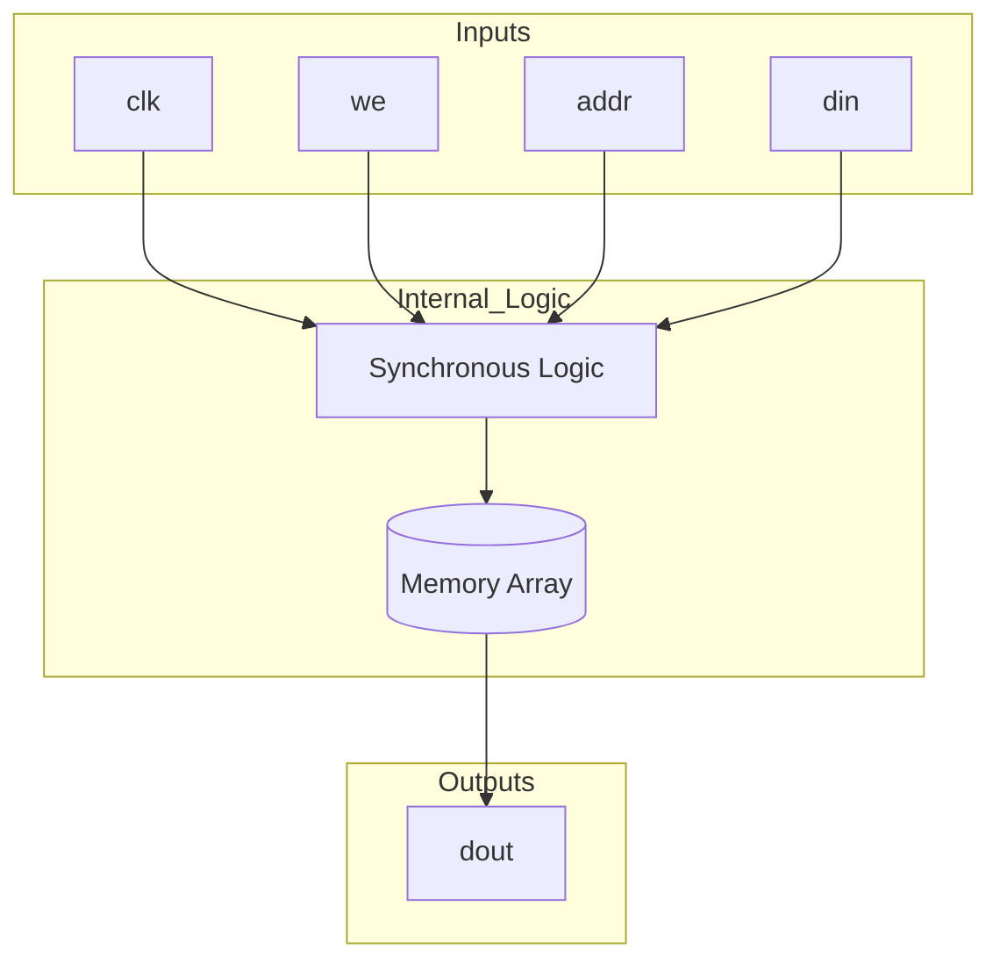
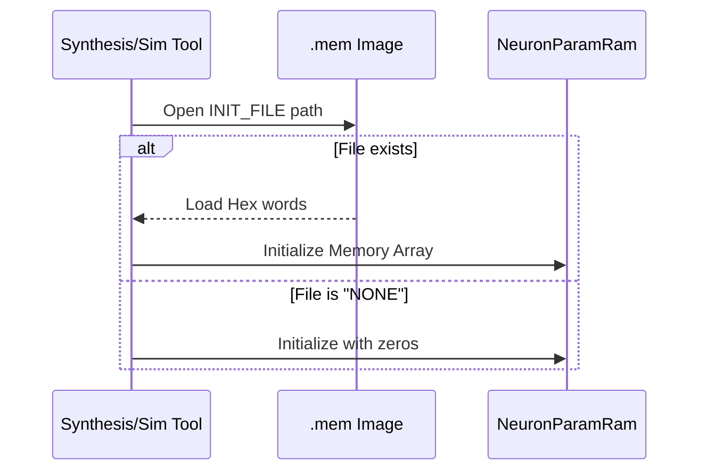

<details>
<summary>Relevant source files</summary>

The following files were used as context for generating this wiki page:

- [spikenaut-core-sv/rtl/NeuronParamRam.sv](spikenaut-core-sv/rtl/NeuronParamRam.sv)
- [spikenaut-core-sv/tb/tb_NeuronParamRam.sv](spikenaut-core-sv/tb/tb_NeuronParamRam.sv)
- [spikenaut-core-sv/mem/README.md](spikenaut-core-sv/mem/README.md)
- [README.md](README.md)
- [CLAUDE.md](CLAUDE.md)
- [AGENTS.md](AGENTS.md)
</details>

# NeuronParamRam

`NeuronParamRam` is a specialized SystemVerilog memory module designed to store and retrieve neuron-specific parameters for a Spiking Neural Network (SNN). It is a core component within the `lib_core` library, providing low-latency access to critical values such as firing thresholds and decay/leak rates required by the [LifNeuron](#lifneuron) processing units.

The module implements a synchronous Block RAM (BRAM) interface, optimized for FPGA implementation on Xilinx Artix-7 devices like the Basys 3. It supports initialization via hex files (Q8.8 format) and provides a simple read/write interface for managing neuron state parameters dynamically or through pre-trained data loads.

Sources: [README.md:27](README.md#L27), [CLAUDE.md:32](CLAUDE.md#L32), [spikenaut-core-sv/rtl/NeuronParamRam.sv:1-15](spikenaut-core-sv/rtl/NeuronParamRam.sv#L1-L15)

## Architecture and Design

The `NeuronParamRam` architecture is built around a synchronous memory array. It utilizes a parameterized approach for address width, data width, and initialization files to maintain flexibility across different network scales. In a typical SoC integration, multiple instances of this module are used to store distinct parameter types, such as one instance for thresholds and another for leak rates.

Sources: [spikenaut-core-sv/mem/README.md:31-35](spikenaut-core-sv/mem/README.md#L31-L35), [spikenaut-core-sv/rtl/NeuronParamRam.sv:17-25](spikenaut-core-sv/rtl/NeuronParamRam.sv#L17-L25)

### Memory Data Flow
The following diagram illustrates the data flow for read and write operations within the module:



The module operates on the rising edge of the clock. When `we` (write enable) is high, the data at `din` is written to the memory location specified by `addr`. The read operation is also synchronous, with the data at `addr` appearing at `dout` after the next rising clock edge.
Sources: [spikenaut-core-sv/rtl/NeuronParamRam.sv:38-45](spikenaut-core-sv/rtl/NeuronParamRam.sv#L38-L45)

## Interface and Configuration

`NeuronParamRam` uses SystemVerilog parameters to define its capacity and initial state.

### Parameters

| Parameter | Type | Default | Description |
|-----------|------|---------|-------------|
| `ADDR_WIDTH` | `int` | `8` | Determines the number of entries (2^ADDR_WIDTH). |
| `DATA_WIDTH` | `int` | `16` | Bit-width of each parameter entry (standard Q8.8). |
| `INIT_FILE` | `string` | `"NONE"` | Path to a `.mem` file for `$readmemh` initialization. |

Sources: [spikenaut-core-sv/rtl/NeuronParamRam.sv:18-21](spikenaut-core-sv/rtl/NeuronParamRam.sv#L18-L21), [spikenaut-core-sv/mem/README.md:20-22](spikenaut-core-sv/mem/README.md#L20-L22)

### Module Ports

| Port Name | Direction | Width | Description |
|-----------|-----------|-------|-------------|
| `clk` | Input | `1` | System clock signal. |
| `we` | Input | `1` | Write enable signal (active high). |
| `addr` | Input | `ADDR_WIDTH` | Address for read/write operations. |
| `din` | Input | `DATA_WIDTH` | Data input for write operations. |
| `dout` | Output | `DATA_WIDTH` | Data output for read operations. |

Sources: [spikenaut-core-sv/rtl/NeuronParamRam.sv:23-30](spikenaut-core-sv/rtl/NeuronParamRam.sv#L23-L30)

## Initialization and Data Format

The module supports initialization during synthesis or simulation using the `$readmemh` system task. The input files are expected to be in hex format, typically representing 16-bit Q8.8 fixed-point numbers.

### Initialization Sequence



Paths passed to `INIT_FILE` are generally relative to the repository root for Verilator or absolute paths for Vivado synthesis.
Sources: [spikenaut-core-sv/mem/README.md:25-29](spikenaut-core-sv/mem/README.md#L25-L29), [spikenaut-core-sv/rtl/NeuronParamRam.sv:34-36](spikenaut-core-sv/rtl/NeuronParamRam.sv#L34-L36)

## Verification and Testing

The `tb_NeuronParamRam.sv` testbench provides functional verification for the module. It ensures that the memory correctly handles write-to-read sequences and maintains data integrity.

### Testbench Operations
The testbench follows a standard stimulus-response pattern:
1.  **Reset/Initialization**: The clock is generated and signals are initialized.
2.  **Write Phase**: Specific values (e.g., `0xABCD`, `0x1234`) are written to chosen addresses (e.g., `10`, `20`).
3.  **Read Phase**: The written addresses are read back.
4.  **Verification**: The testbench compares `dout` against the expected `din` values. If a mismatch occurs, it increments an error counter and terminates with `$fatal`.

Sources: [spikenaut-core-sv/tb/tb_NeuronParamRam.sv:20-60](spikenaut-core-sv/tb/tb_NeuronParamRam.sv#L20-L60)

### Verilator Execution
To run the unit test for this module using Verilator:

```bash
verilator --binary --timing -Wno-WIDTHEXPAND -Wno-DECLFILENAME -Wno-TIMESCALEMOD \
  --top-module tb_NeuronParamRam \
  -Ispikenaut-core-sv/rtl \
  spikenaut-core-sv/rtl/NeuronParamRam.sv \
  spikenaut-core-sv/tb/tb_NeuronParamRam.sv
./obj_dir/Vtb_NeuronParamRam
```

Sources: [AGENTS.md:38-48](AGENTS.md#L38-L48)

## Summary

`NeuronParamRam` serves as a critical storage element for neuron-specific constants within the `silicon-hdl` project. By providing a clean interface for Q8.8 parameter storage and supporting file-based initialization, it enables the integration of pre-trained SNN models into hardware. Its design ensures compatibility with standard FPGA BRAM resources while maintaining the project's strict deduplication and single-source-of-truth standards.

Sources: [README.md:21-25](README.md#L21-L25), [CLAUDE.md:32](CLAUDE.md#L32), [spikenaut-core-sv/rtl/NeuronParamRam.sv](spikenaut-core-sv/rtl/NeuronParamRam.sv)
