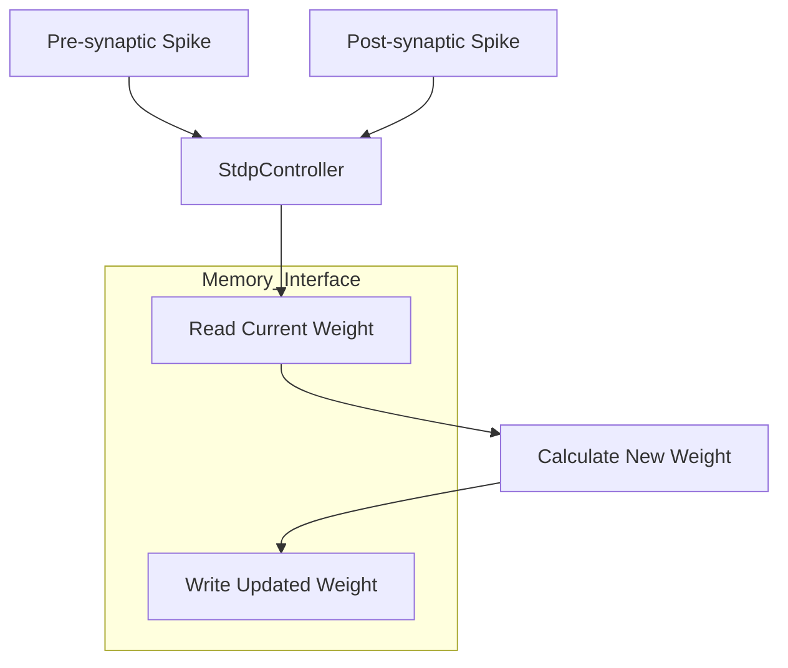
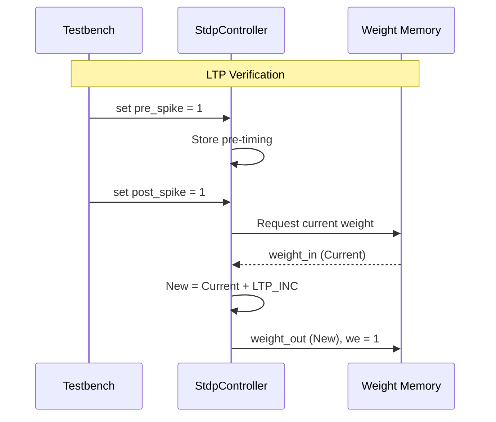

Relevant source files

The following files were used as context for generating this wiki page:

- [spikenaut-core-sv/rtl/StdpController.sv](spikenaut-core-sv/rtl/StdpController.sv)
- [spikenaut-core-sv/tb/tb_StdpController.sv](spikenaut-core-sv/tb/tb_StdpController.sv)
- [README.md](README.md)
- [AGENTS.md](AGENTS.md)
- [CLAUDE.md](CLAUDE.md)
- [spikenaut-core-sv/mem/README.md](spikenaut-core-sv/mem/README.md)

# StdpController (STDP Plasticity)

The `StdpController` is a core module within the `lib_core` library of the `silicon-hdl` project. Its primary purpose is to implement Spike-Timing-Dependent Plasticity (STDP), a biological learning rule that adjusts the strength of connections (synaptic weights) between neurons based on the relative timing of their spikes. It operates alongside other neural primitives like the [LifNeuron](#lifneuron) and [WeightRam](#weightram) to enable adaptive behavior in Spiking Neural Networks (SNNs).

Sources: [README.md](README.md), [CLAUDE.md](CLAUDE.md), [spikenaut-core-sv/rtl/StdpController.sv:1-5](spikenaut-core-sv/rtl/StdpController.sv#L1-L5)

## Architecture and Design

The `StdpController` is designed as a modular component within the Spikenaut core. It interfaces with memory structures to manage synaptic weights and timing information. The module utilizes a standard SystemVerilog implementation targeting FPGA deployment, specifically the Artix-7 series found on the Digilent Basys 3 development board.

Sources: [README.md](README.md), [spikenaut-core-sv/rtl/StdpController.sv:1-10](spikenaut-core-sv/rtl/StdpController.sv#L1-L10)

### Functional Overview

The controller monitors pre-synaptic and post-synaptic spike events to calculate weight updates. While the specific mathematical implementation details (such as exponential decay constants) are abstracted into parameters, the core logic involves:
1. Detecting a pre-synaptic spike.
2. Detecting a post-synaptic spike.
3. Calculating the time difference ($\Delta t$).
4. Applying a weight increment (Long-Term Potentiation - LTP) or decrement (Long-Term Depression - LTD) to the corresponding entry in the [WeightRam](#weightram).

Sources: [spikenaut-core-sv/rtl/StdpController.sv](spikenaut-core-sv/rtl/StdpController.sv), [spikenaut-core-sv/mem/README.md](spikenaut-core-sv/mem/README.md)

### Data Flow Diagram

The following diagram illustrates the high-level data flow between the `StdpController` and associated SNN components.

*Note: The StdpController interacts with external weight storage to perform atomic read-modify-write operations for learning.*

Sources: [spikenaut-core-sv/rtl/StdpController.sv](spikenaut-core-sv/rtl/StdpController.sv), [README.md](README.md)

## Module Configuration

The `StdpController` supports various parameters to define its bit-width, timing windows, and learning rates.

### Parameters

| Parameter | Type | Default | Description |
|---|---|---|---|
| `DATA_WIDTH` | integer | 16 | Bit-width for weight values (often Q8.8 format). |
| `ADDR_WIDTH` | integer | 10 | Address width for the synapse memory. |
| `LTP_INC` | logic [DATA_WIDTH-1:0] | - | Fixed increment value for Long-Term Potentiation. |
| `LTD_DEC` | logic [DATA_WIDTH-1:0] | - | Fixed decrement value for Long-Term Depression. |

Sources: [spikenaut-core-sv/rtl/StdpController.sv](spikenaut-core-sv/rtl/StdpController.sv), [spikenaut-core-sv/mem/README.md](spikenaut-core-sv/mem/README.md)

### Ports

| Port | Direction | Width | Description |
|---|---|---|---|
| `clk` | Input | 1 | System clock. |
| `rst_n` | Input | 1 | Active-low asynchronous reset. |
| `pre_spike` | Input | 1 | Trigger indicating a pre-synaptic spike event. |
| `post_spike` | Input | 1 | Trigger indicating a post-synaptic spike event. |
| `weight_in` | Input | `DATA_WIDTH` | Current weight fetched from memory. |
| `weight_out` | Output | `DATA_WIDTH` | Updated weight to be written back to memory. |
| `we` | Output | 1 | Write enable signal for weight memory. |

Sources: [spikenaut-core-sv/rtl/StdpController.sv:7-25](spikenaut-core-sv/rtl/StdpController.sv#L7-L25)

## Integration and Testing

The `StdpController` is verified using a dedicated Verilator-based testbench. Following the project convention, stimulus is driven on the `negedge clk` to ensure clean sampling by the `posedge` triggered RTL logic.

Sources: [AGENTS.md](AGENTS.md), [spikenaut-core-sv/tb/tb_StdpController.sv](spikenaut-core-sv/tb/tb_StdpController.sv)

### Verification Sequence

The testbench (`tb_StdpController.sv`) performs several checks to ensure the plasticity rules are applied correctly:
1. **Reset Check**: Ensures weights remain unchanged and write enable is low after reset.
2. **LTP Test**: Triggers a pre-synaptic spike followed by a post-synaptic spike to verify weight incrementing.
3. **LTD Test**: Triggers a post-synaptic spike followed by a pre-synaptic spike to verify weight decrementing.

*Note: The sequence diagram depicts the interaction during a successful LTP event.*

Sources: [spikenaut-core-sv/tb/tb_StdpController.sv](spikenaut-core-sv/tb/tb_StdpController.sv), [AGENTS.md](AGENTS.md)

## Implementation Details

The controller is a state-machine driven module that manages the temporal dependencies between spikes.

### Key Logic Structures
- **Timing Registers**: Internal counters or timestamps that track the time elapsed since the last pre- and post-synaptic spikes.
- **Update Logic**: Combinational logic that determines if a weight update is required based on incoming spike flags.
- **Saturation Logic**: Ensures that weight updates do not overflow or underflow the `DATA_WIDTH` limits.

Sources: [spikenaut-core-sv/rtl/StdpController.sv](spikenaut-core-sv/rtl/StdpController.sv), [spikenaut-core-sv/mem/README.md](spikenaut-core-sv/mem/README.md)

## Summary

The `StdpController` provides the essential mechanism for on-chip learning within the `silicon-hdl` ecosystem. By implementing STDP, it allows the network to adapt its synaptic strengths dynamically. It is optimized for FPGA resource efficiency and is strictly governed by the project's deduplication and quality standards, ensuring it remains the single source of truth for plasticity logic.

Sources: [README.md](README.md), [AGENTS.md](AGENTS.md), [CLAUDE.md](CLAUDE.md)
