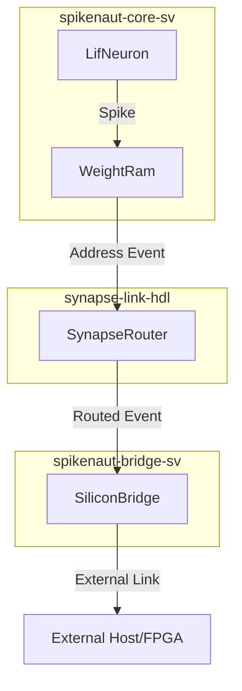
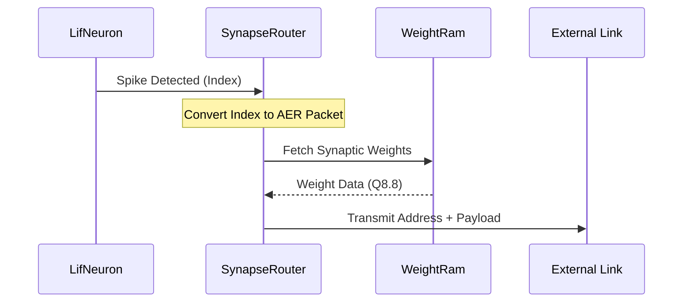

<details>
<summary>Relevant source files</summary>

The following files were used as context for generating this wiki page:

- [synapse-link-hdl/src/SynapseRouter.sv](synapse-link-hdl/src/SynapseRouter.sv)
- [README.md](README.md)
- [CLAUDE.md](CLAUDE.md)
- [AGENTS.md](AGENTS.md)
- [spikenaut-core-sv/mem/README.md](spikenaut-core-sv/mem/README.md)

</details>

# SynapseRouter (AER Routing)

The `SynapseRouter` is a fundamental communication module within the `silicon-hdl` monorepo, specifically residing in the `lib_synapse` library. Its primary purpose is to implement Address-Event Representation (AER) routing, a protocol used in neuromorphic systems to communicate spikes between neurons or neural layers. It serves as a bridge between spiking neural network (SNN) logic and external communication or internal routing fabrics.

This module is part of the project's effort to provide deduplicated, Vivado-ready SystemVerilog primitives for neuromorphic computing on FPGA platforms like the Digilent Basys 3. The `SynapseRouter` facilitates the transport of asynchronous spike events by representing them as addresses, allowing for efficient high-speed communication within the [spikenaut-core-sv](#spikenaut-core-sv) architecture.

Sources: [README.md:14-36](README.md#L14-L36), [CLAUDE.md:60-65](CLAUDE.md#L60-L65)

## Architecture and Design Principles

The `SynapseRouter` follows a strict single-source-of-truth policy enforced by the project's Deduplication Guardian. It is the canonical module for AER routing and should not be duplicated or redefined in other parts of the repository.

### Monorepo Integration
The project architecture uses a fixed dependency order: `lib_bridge` → `lib_core` → `lib_soc` / `lib_synapse`. `SynapseRouter` sits at the top of this hierarchy, potentially instantiating bridge or core primitives if required by its implementation, though it is primarily designed as a standalone routing primitive in the `synapse-link-hdl` path.

Sources: [CLAUDE.md:46-52](CLAUDE.md#L46-L52), [AGENTS.md:120-125](AGENTS.md#L120-L125)

### Data Flow Diagram
The following diagram illustrates the conceptual flow of AER data through the `SynapseRouter` within a neuromorphic SoC context.



The diagram shows how spikes generated in the core (e.g., from `LifNeuron`) are translated into address events and routed through the `SynapseRouter` toward bridge primitives.
Sources: [README.md:23-35](README.md#L23-L35), [CLAUDE.md:60-65](CLAUDE.md#L60-L65)

## Module Ownership and Structure

The `SynapseRouter` is strictly owned by the `lib_synapse` library. The monorepo structure ensures that no duplicate definitions exist, with `scripts/dedup_guardian.py` performing static analysis to maintain this purity.

| Module Name | Canonical Path | Responsibility |
|:--- |:--- |:--- |
| `SynapseRouter` | `synapse-link-hdl/src/SynapseRouter.sv` | AER routing and spike event distribution. |
| `synapse_demo_basys3_top` | `synapse-link-hdl/examples/basys3/Basys3_Top.sv` | Top-level integration for AER demonstrations. |

Sources: [README.md:41-51](README.md#L41-L51), [CLAUDE.md:65](CLAUDE.md#L65)

### Single Source of Truth Enforcement
Every `.sv` file for the router must include a canonical source header to pass the Deduplication Guardian checks. This prevents "near-duplicates" that might occur during iterative learning or FPGA bring-up.

```systemverilog
// SPDX-License-Identifier: MIT OR Apache-2.0
// SynapseRouter.sv
// Canonical source: synapse-link-hdl/src
```

Sources: [CLAUDE.md:66-70](CLAUDE.md#L66-L70), [README.md:64-77](README.md#L64-L77)

## Implementation Context

While the specific internal logic of `SynapseRouter.sv` focuses on AER, it operates in an environment where neural parameters and weights are handled via standard memory primitives.

### Memory and Parameters
Routing often involves looking up destination addresses or weights. The project utilizes `WeightRam` and `NeuronParamRam` to manage these values, often initialized via `$readmemh` from `.mem` files in the `spikenaut-core-sv/mem` directory.

| Component | Description | Relevance to Routing |
|:--- |:--- |:--- |
| `WeightRam` | Stores 16x16 hidden weights (Q8.8 format). | Provides synapse strengths for routed spikes. |
| `NeuronParamRam` | Stores thresholds and decay rates. | Determines if a neuron generates a spike to be routed. |

Sources: [spikenaut-core-sv/mem/README.md:7-16](spikenaut-core-sv/mem/README.md#L7-L16), [README.md:41-44](README.md#L41-L44)

### Routing Logic Sequence
The sequence below describes the interaction between a spike event and the routing mechanism.



Sources: [spikenaut-core-sv/mem/README.md:32-40](spikenaut-core-sv/mem/README.md#L32-L40), [README.md:23-35](README.md#L23-L35)

## Development and Quality Assurance

The `SynapseRouter` implementation is subject to rigorous quality checks using both Verilator and Vivado.

1.  **Verilator Simulation:** Used for fast iterative testing of the routing logic without requiring a Vivado license.
2.  **Vivado Synthesis:** Final implementation targeting the Artix-7 (Basys 3) platform to ensure timing closure.
3.  **Deduplication:** The `dedup_guardian.py` script ensures the `SynapseRouter` module remains unique and centrally located.

The `scripts/quality.sh` tool automates these checks to maintain a high "Purity Score" for the repository.

Sources: [AGENTS.md:25-35](AGENTS.md#L25-L35), [scripts/quality.sh:45-55](scripts/quality.sh#L45-L55), [scripts/dedup_guardian.py:15-30](scripts/dedup_guardian.py#L15-L30)

## Summary

`SynapseRouter (AER Routing)` is a critical component for spike-based communication in the `silicon-hdl` project. By implementing the AER protocol, it enables the modular connection of neurons and layers across the SNN architecture. Its development is governed by strict monorepo rules to ensure code reusability and hardware efficiency, providing a robust primitive for neuromorphic hardware co-design.
