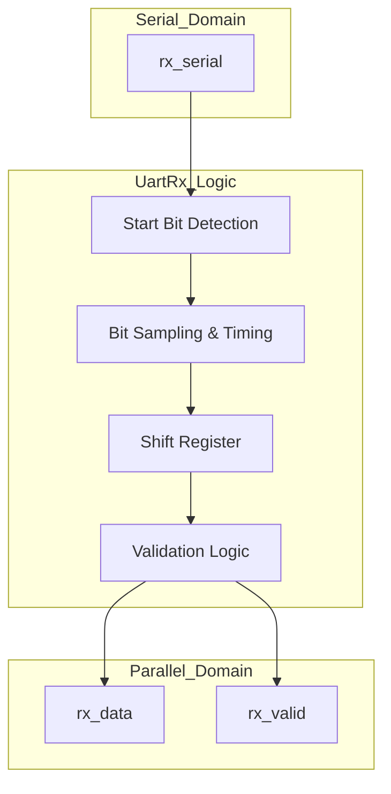
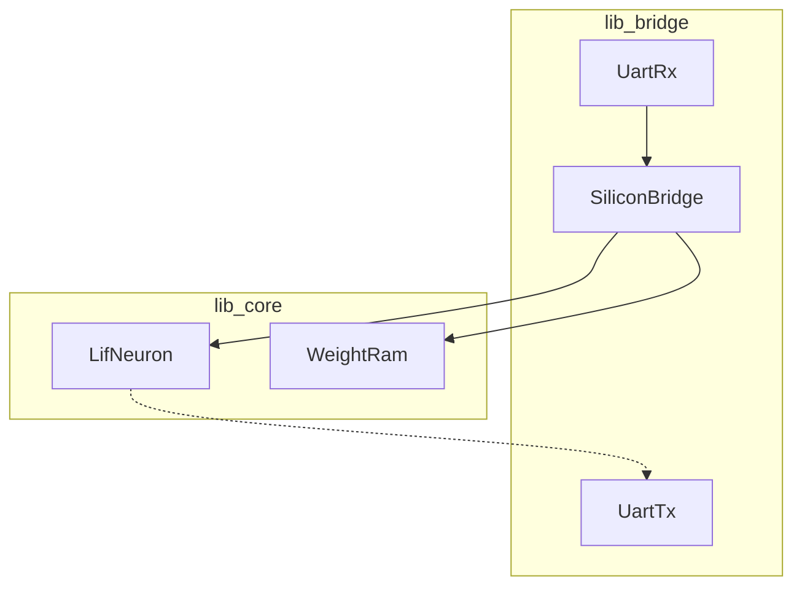

Relevant source files

The following files were used as context for generating this wiki page:

- [spikenaut-bridge-sv/rtl/UartRx.sv](spikenaut-bridge-sv/rtl/UartRx.sv)
- [AGENTS.md](AGENTS.md)
- [CLAUDE.md](CLAUDE.md)
- [README.md](README.md)
- [scripts/dedup_guardian.py](scripts/dedup_guardian.py)

# UART Receiver (UartRx)

The `UartRx` module is a fundamental communication primitive within the `silicon-hdl` project, specifically residing in the `lib_bridge` library. Its primary purpose is to receive asynchronous serial data and convert it into parallel data for use by the neuromorphic system. It is designed to work in conjunction with `UartTx` and the `SiliconBridge` to facilitate data transfer between the FPGA and external interfaces.

Sources: [README.md:32](README.md#L32), [CLAUDE.md:46](CLAUDE.md#L46), [AGENTS.md:95](AGENTS.md#L95)

## Module Architecture and Interface

The `UartRx` module uses a parameterized `DATA_WIDTH` which, although protocol-fixed at 8-bit framing for standard UART, is propagated through the bridge primitives to maintain design consistency. The module is located canonically at `spikenaut-bridge-sv/rtl/UartRx.sv`.

Sources: [AGENTS.md:95](AGENTS.md#L95), [README.md:57](README.md#L57)

### Parameters and Ports

| Name | Type | Direction | Description |
| :--- | :--- | :--- | :--- |
| `DATA_WIDTH` | Parameter | N/A | Width of the data word (default is 8). |
| `clk` | Input | Input | System clock signal. |
| `rst_n` | Input | Input | Active-low asynchronous reset. |
| `rx_serial` | Input | Input | Asynchronous serial input line. |
| `rx_data` | Output | Output | Parallel data output of `DATA_WIDTH`. |
| `rx_valid` | Output | Output | Signal indicating `rx_data` is valid. |

Sources: [AGENTS.md:95](AGENTS.md#L95), [spikenaut-bridge-sv/rtl/UartRx.sv](spikenaut-bridge-sv/rtl/UartRx.sv)

### Functional Overview

The following diagram illustrates the high-level flow of the UART reception process, where serial bitstreams are sampled and converted into parallel bytes for the `SiliconBridge`.

The `UartRx` module logic typically involves detecting a transition on the `rx_serial` line, sampling bits at the appropriate baud rate intervals, and asserting `rx_valid` once a full frame is captured.
Sources: [spikenaut-bridge-sv/rtl/UartRx.sv](spikenaut-bridge-sv/rtl/UartRx.sv), [AGENTS.md:95](AGENTS.md#L95)

## System Integration

`UartRx` is a key component of the `lib_bridge` library, which serves as the entry point for data into the `spikenaut-core`. It follows a strict dependency order where `lib_bridge` modules are considered base primitives.

Sources: [CLAUDE.md:46](CLAUDE.md#L46), [README.md:32](README.md#L32)

The diagram above shows the dependency flow where `UartRx` provides the raw data input that is subsequently handled by the `SiliconBridge` to update neuron parameters or weights in the core logic.
Sources: [CLAUDE.md:42-47](CLAUDE.md#L42-L47), [README.md:42-52](README.md#L42-L52)

## Governance and Quality Control

As a canonical module, `UartRx` is subject to the **Deduplication Guardian** checks. This ensures that the module definition exists only in its assigned path (`spikenaut-bridge-sv/rtl/UartRx.sv`) and prevents parallel, conflicting implementations within the monorepo.

Sources: [scripts/dedup_guardian.py:17-25](scripts/dedup_guardian.py#L17-L25), [CLAUDE.md:55-57](CLAUDE.md#L55-L57)

### Strict Single-Source-of-Truth
The Deduplication Guardian performs the following checks on `UartRx`:
1.  **Strict Duplicate Check**: Ensures `module UartRx` is defined exactly once in the repository.
2.  **Canonical Path Verification**: Validates that the definition resides in the `spikenaut-bridge-sv/rtl/` directory.
3.  **Similarity Radar**: Scans for near-duplicate code that might indicate an unofficial fork of the receiver logic.

Sources: [scripts/dedup_guardian.py:72-85](scripts/dedup_guardian.py#L72-L85), [README.md:73](README.md#L73)

## Conclusion
The `UartRx` module is an essential communication block for the silicon-hdl neuromorphic platform. By providing a standardized 8-bit serial-to-parallel interface, it allows the FPGA-based Spiking Neural Network (SNN) to receive external stimuli and configuration data. Its implementation is protected by the project's strict deduplication and quality standards, ensuring architectural integrity across the monorepo.

Sources: [README.md:12-18](README.md#L12-L18), [CLAUDE.md:42-47](CLAUDE.md#L42-L47)
