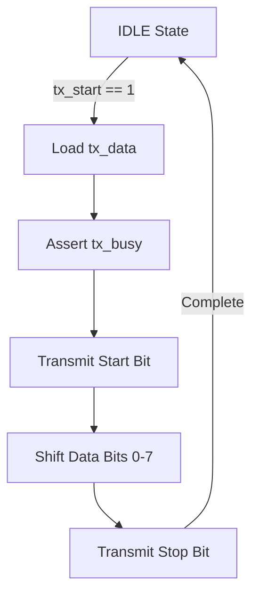

<details>
<summary>Relevant source files</summary>

The following files were used as context for generating this wiki page:

- [spikenaut-bridge-sv/rtl/UartTx.sv](spikenaut-bridge-sv/rtl/UartTx.sv)
- [AGENTS.md](AGENTS.md)
- [CLAUDE.md](CLAUDE.md)
- [README.md](README.md)
- [scripts/build_soc.tcl](scripts/build_soc.tcl)
</details>

# UART Transmitter (UartTx)

The `UartTx` module is a fundamental communication primitive within the `lib_bridge` library of the `silicon-hdl` project. Its primary purpose is to provide asynchronous serial data transmission capabilities, facilitating communication between the neuromorphic FPGA primitives and external systems. It operates as part of the `SiliconBridge` to enable data offloading and monitoring for Spikenaut neural network cores.
Sources: [README.md:31](README.md#L31), [CLAUDE.md:46](CLAUDE.md#L46), [AGENTS.md:79](AGENTS.md#L79)

Within the project architecture, `UartTx` follows a strict single-source-of-truth rule and is located in the `spikenaut-bridge-sv/rtl` directory. It is designed to be instantiated within higher-level System-on-Chip (SoC) wrappers, such as `spikenaut_soc_basys3_top`, without duplication across the monorepo.
Sources: [README.md:45](README.md#L45), [CLAUDE.md:46](CLAUDE.md#L46)

## Architecture and Design

The `UartTx` module implements a standard UART protocol framing. While the hardware implementation allows for parameterization, the project context establishes a default configuration of 8-bit data width to match standard wire protocols.
Sources: [AGENTS.md:79](AGENTS.md#L79)

### Port Definitions
The module interfaces with the system via standard clock and reset signals, alongside data input and status output signals to manage the transmission flow.

| Port | Direction | Description |
|---|---|---|
| `clk` | Input | System clock signal. |
| `rst_n` | Input | Active-low synchronous reset. |
| `tx_data` | Input | The data byte/word to be transmitted. |
| `tx_start` | Input | Trigger signal to begin transmission. |
| `tx_busy` | Output | Status signal indicating a transmission is in progress. |
| `uart_tx` | Output | The physical serial output pin. |

Sources: [spikenaut-bridge-sv/rtl/UartTx.sv](spikenaut-bridge-sv/rtl/UartTx.sv)

### Functional Flow
The transmitter waits for a `tx_start` pulse, at which point it captures the `tx_data` and asserts `tx_busy`. It then shifts out the start bit, data bits, and stop bit at a baud rate determined by internal clock dividers.



The diagram represents the high-level state progression for a single byte transmission cycle.
Sources: [spikenaut-bridge-sv/rtl/UartTx.sv](spikenaut-bridge-sv/rtl/UartTx.sv)

## Library and Dependency Context

`UartTx` belongs to `lib_bridge`, which occupies the first position in the project's fixed dependency order: `lib_bridge` → `lib_core` → `lib_soc` / `lib_synapse`. This ensures that communication primitives are available to all higher-level neuromorphic logic.
Sources: [AGENTS.md:68](AGENTS.md#L68), [CLAUDE.md:42](CLAUDE.md#L42)

### Integration in SoC
In the `spikenaut-soc-sv` implementation, `UartTx` is integrated into the bridge logic to facilitate host-to-FPGA communication. The Vivado build process references this canonical source file directly.

```tcl
# Example of how UartTx is referenced in build scripts
read_verilog -sv spikenaut-bridge-sv/rtl/UartTx.sv
```

Sources: [scripts/build_soc.tcl](scripts/build_soc.tcl), [AGENTS.md:58](AGENTS.md#L58)

## Configuration Parameters

The module uses SystemVerilog parameters to define its operational characteristics. Although the project defaults to 8-bit framing, the `DATA_WIDTH` is propagated through the bridge modules for consistency.
Sources: [AGENTS.md:79](AGENTS.md#L79)

| Parameter | Type | Default | Description |
|---|---|---|---|
| `DATA_WIDTH` | Integer | 8 | Width of the data payload per UART frame. |
| `CLKS_PER_BIT` | Integer | - | Calculated value based on system clock and target baud rate. |

Sources: [spikenaut-bridge-sv/rtl/UartTx.sv](spikenaut-bridge-sv/rtl/UartTx.sv), [AGENTS.md:79](AGENTS.md#L79)

## Testing and Quality Assurance

Quality for the `UartTx` module is maintained through strict deduplication checks and simulation. The **Deduplication Guardian** ensures that only one definition of `module UartTx` exists in the repository to prevent hardware conflicts and synthesis errors.
Sources: [README.md:76](README.md#L76), [CLAUDE.md:57](CLAUDE.md#L57)

The module is verified as part of the `lib_bridge` test suite, though specific unit testbench files (`tb_UartTx.sv`) are referenced as standard components of the `spikenaut-bridge-sv/tb` directory.
Sources: [README.md:31](README.md#L31), [scripts/quality.sh:45](scripts/quality.sh#L45)

## Summary
The `UartTx` module serves as a reliable serial data egress point for the Spikenaut neuromorphic system. By maintaining a single canonical source in `spikenaut-bridge-sv/rtl/UartTx.sv`, the project ensures consistent communication timing and protocol adherence across different SoC implementations and demos.
Sources: [README.md:45](README.md#L45), [CLAUDE.md:46](CLAUDE.md#L46)
