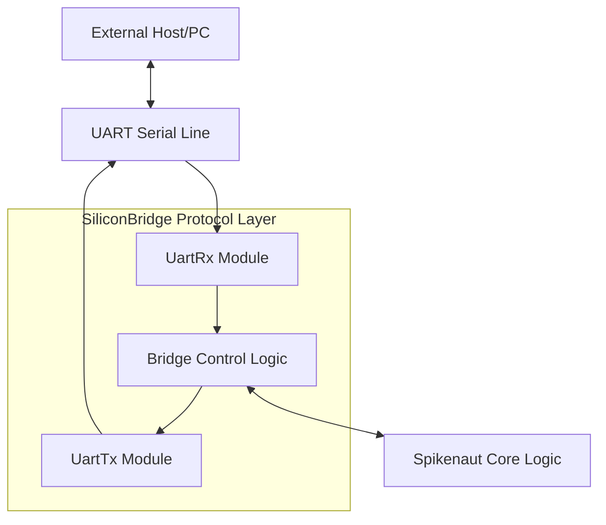
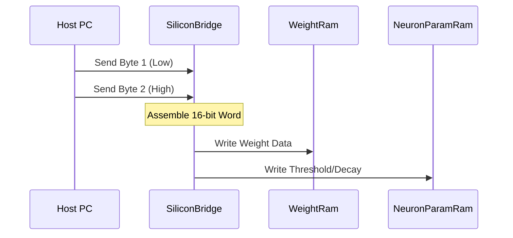

Relevant source files

The following files were used as context for generating this wiki page:

- [spikenaut-bridge-sv/rtl/SiliconBridge.sv](spikenaut-bridge-sv/rtl/SiliconBridge.sv)
- [CLAUDE.md](CLAUDE.md)
- [AGENTS.md](AGENTS.md)
- [README.md](README.md)
- [spikenaut-core-sv/mem/README.md](spikenaut-core-sv/mem/README.md)

# SiliconBridge Protocol Layer

The SiliconBridge Protocol Layer serves as the primary communication interface between the neuromorphic hardware primitives and external systems. Residing within the `lib_bridge` library, it encapsulates the logic necessary for handling data transmission and reception, typically over Universal Asynchronous Receiver/Transmitter (UART) interfaces. Its purpose is to bridge the high-level address-event representation (AER) or spiking neural network (SNN) data with standard serial protocols.

Within the `silicon-hdl` monorepo, SiliconBridge acts as a canonical communication primitive, ensuring a single source of truth for how the Spikenaut core modules interact with off-chip components. It provides a standardized data path that allows for the loading of neuron parameters and weights into memory blocks like `WeightRam` and `NeuronParamRam`.

Sources: [CLAUDE.md:46](CLAUDE.md#L46), [README.md:49-55](README.md#L49-L55), [spikenaut-bridge-sv/rtl/SiliconBridge.sv](spikenaut-bridge-sv/rtl/SiliconBridge.sv)

## Architecture and Components

The SiliconBridge module is designed to interface directly with UART receiver and transmitter modules. It handles the framing of data packets, ensuring that 8-bit serial words are correctly interpreted by the internal SNN logic. The architecture follows a strict dependency order where `lib_bridge` primitives are utilized by higher-level modules in `lib_core` and `lib_soc`.

### Internal Data Flow

The data flow within SiliconBridge involves receiving serial data via a `UartRx` instance, processing the incoming bytes, and providing them to the SoC internal bus or specific neuromorphic modules. Conversely, it takes internal status or spike data and serializes it through a `UartTx` instance for transmission to the host.

The diagram shows the bidirectional path between a host and the internal SNN core through the SiliconBridge components. 
Sources: [CLAUDE.md:46](CLAUDE.md#L46), [README.md:37-47](README.md#L37-L47)

### Component Specifications

SiliconBridge leverages a fixed 8-bit framing protocol, though the `DATA_WIDTH` parameter is propagated through the hierarchy for consistency. This parameterization allows the bridge to remain flexible while adhering to standard wire protocols.

| Parameter | Default Value | Description |
|---|---|---|
| `DATA_WIDTH` | 8 | Width of the data word for UART framing |
| `BAUD_RATE` | Dependent on SoC | Target bit rate for serial communication |

Sources: [AGENTS.md:96-99](AGENTS.md#L96-L99), [spikenaut-bridge-sv/rtl/SiliconBridge.sv](spikenaut-bridge-sv/rtl/SiliconBridge.sv)

## Memory and Parameter Loading

A critical function of the SiliconBridge layer is facilitating the initialization of neuromorphic parameters. The bridge protocol supports the transfer of hex `.mem` files (Q8.8 format) into specialized RAM blocks. This is essential for setting neuron thresholds, decay rates, and synaptic weights.

### Q8.8 Data Format Handling

The bridge processes 16-bit Q8.8 hex words, which are often provided in groups (e.g., 16 lines for thresholds, 256 lines for hidden weights). While the wire protocol is 8-bit, the bridge logic assembles these into the 16-bit format required by the SNN core.

The sequence illustrates how individual bytes received over the serial interface are reconstructed into the Q8.8 format used by internal memories.
Sources: [spikenaut-core-sv/mem/README.md:5-20](spikenaut-core-sv/mem/README.md#L5-L20), [spikenaut-core-sv/mem/README.md:40-45](spikenaut-core-sv/mem/README.md#L40-L45)

## System Integration

SiliconBridge is integrated into the `spikenaut_soc_basys3_top` wrapper, which targets the Artix-7 FPGA on the Digilent Basys 3 board. In this context, it manages the control signals between the physical I/O pins and the internal `LifNeuron` and `StdpController` modules.

### Dependency Hierarchy

The project enforces a strict dependency direction where the bridge must be compiled before the core and SoC layers. This ensures that the communication infrastructure is defined and available for instantiation by the neuromorphic logic.

1. `lib_bridge`: `UartRx`, `UartTx`, `SiliconBridge`
2. `lib_core`: `LifNeuron`, `WeightRam`, `StdpController`
3. `lib_soc`: `Basys3_Top.sv`

Sources: [CLAUDE.md:42-47](CLAUDE.md#L42-L47), [README.md:37-47](README.md#L37-L47), [AGENTS.md:83-84](AGENTS.md#L83-L84)

## Summary

The SiliconBridge Protocol Layer is a foundational component of the `silicon-hdl` repository, providing the necessary abstractions for serial communication. By standardizing the interface between the FPGA's physical UART pins and the internal neuromorphic primitives, it enables robust parameter loading and data monitoring. Its adherence to the monorepo's "single source of truth" principle ensures that communication logic remains consistent across different SoC implementations and simulation environments.
