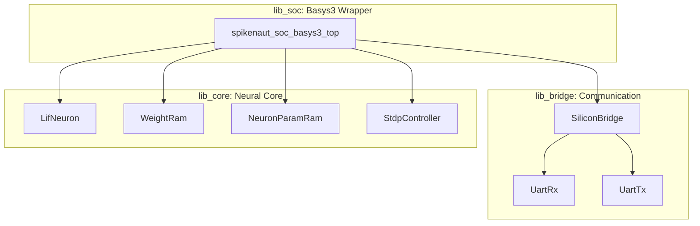
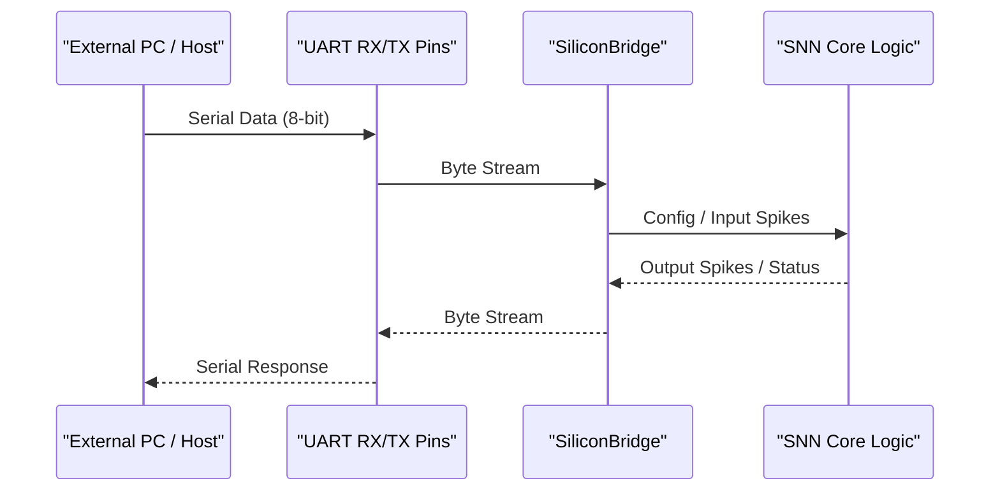

<details>
<summary>Relevant source files</summary>

The following files were used as context for generating this wiki page:

- [spikenaut-soc-sv/rtl/Basys3_Top.sv](spikenaut-soc-sv/rtl/Basys3_Top.sv)
- [AGENTS.md](AGENTS.md)
- [CLAUDE.md](CLAUDE.md)
- [README.md](README.md)
- [spikenaut-core-sv/mem/README.md](spikenaut-core-sv/mem/README.md)
- [scripts/build_soc.tcl](scripts/build_soc.tcl)
</details>

# Spikenaut SoC Basys3 Wrapper

The Spikenaut SoC Basys3 Wrapper, implemented as the module `spikenaut_soc_basys3_top`, serves as the top-level hardware integration layer for the Spikenaut neuromorphic processor on the Digilent Basys 3 FPGA development board. This module encapsulates canonical SNN (Spiking Neural Network) logic and communication primitives into a unified System-on-Chip (SoC) architecture specifically tailored for the Artix-7 `xc7a35tcpg236-1` FPGA.

The primary purpose of this wrapper is to bridge high-level neural processing components with physical hardware interfaces, including UART for external communication and specialized memory blocks for storing synaptic weights and neuron parameters. It adheres to a strict single-source-of-truth architecture, where the wrapper only *instantiates* modules from the `lib_core` and `lib_bridge` libraries without duplicating their logic.

Sources: [README.md:1-25](README.md#L1-L25), [CLAUDE.md:30-40](CLAUDE.md#L30-L40), [AGENTS.md:75-85](AGENTS.md#L75-L85)

## Architectural Overview

The SoC architecture is organized into a hierarchical library structure. The Basys3 Wrapper (`lib_soc`) occupies the top level of this hierarchy, depending on the communication bridge (`lib_bridge`) and the neural processing core (`lib_core`).

### System Integration Flow
The following diagram illustrates how the `spikenaut_soc_basys3_top` module integrates disparate functional blocks into the final SoC.



The wrapper manages the data flow between the UART-based `SiliconBridge` and the neuromorphic primitives like `LifNeuron` and `WeightRam`.
Sources: [README.md:27-45](README.md#L27-L45), [CLAUDE.md:42-50](CLAUDE.md#L42-L50)

## Memory and Parameter Initialization

A critical function of the Basys3 Wrapper is the management of memory images for the neural network. The SoC utilizes SystemVerilog `$readmemh` tasks to initialize Block RAM (BRAM) components with pre-trained weights and neuron parameters (Q8.8 fixed-point format).

### Memory Mapping and Initialization Files
The wrapper wires specific hex `.mem` files to the internal RAM instances. During synthesis, these paths are passed via absolute paths in the Vivado `build_soc.tcl` script.

| Component Instance | Memory Image File | Purpose | ADDR_WIDTH |
|:---|:---|:---|:---|
| `u_wram` | `merged_v2_weights.mem` | 16×16 hidden weights | 8 (256 entries) |
| `u_npram_threshold` | `merged_v2_thresholds.mem` | Neuron firing thresholds | 8 (16 used) |
| `u_npram_leak` | `merged_v2_decay.mem` | Leak / decay rates | 8 (16 used) |

Sources: [spikenaut-core-sv/mem/README.md:1-45](spikenaut-core-sv/mem/README.md#L1-L45), [scripts/build_soc.tcl](scripts/build_soc.tcl)

## Hardware Interfacing

The wrapper maps internal signals to the physical constraints of the Basys 3 board. This includes clock management, reset logic, and UART pins.

### UART Communication Flow
The `SiliconBridge` within the wrapper facilitates 8-bit framing for external configuration and data retrieval.



UART parameters such as `DATA_WIDTH` are propagated through the `SiliconBridge` to maintain consistency with the wire protocol.
Sources: [AGENTS.md:88-92](AGENTS.md#L88-L92), [CLAUDE.md:46-48](CLAUDE.md#L46-L48)

## Implementation Constraints and Build

The SoC is designed for the Artix-7 FPGA, and its implementation is governed by specific build scripts and deduplication rules.

*  **Deduplication Guardian:** Every module within the wrapper must be unique. The wrapper itself is named `spikenaut_soc_basys3_top` to avoid name collisions with other demo wrappers like `synapse_demo_basys3_top`.
*  **Timing Verification:** The build process involves checking Worst Negative Slack (WNS) and Worst Hold Slack (WHS) to ensure timing closure at the target frequency.

### Build Command
The SoC is synthesized and implemented using a Tcl-based batch flow in Vivado:

```bash
vivado -mode batch -source scripts/build_soc.tcl
```

Sources: [README.md:55-70](README.md#L55-L70), [scripts/quality.sh:75-85](scripts/quality.sh#L75-L85), [AGENTS.md:55-65](AGENTS.md#L55-L65)

## Conclusion
The `spikenaut_soc_basys3_top` wrapper provides the necessary infrastructure to deploy Spikenaut SNN primitives onto physical hardware. By managing memory initialization for Q8.8 parameters and abstracting communication via `SiliconBridge`, it enables a functional neuromorphic SoC while maintaining strict library boundaries and deduplication standards required by the project's architecture.
