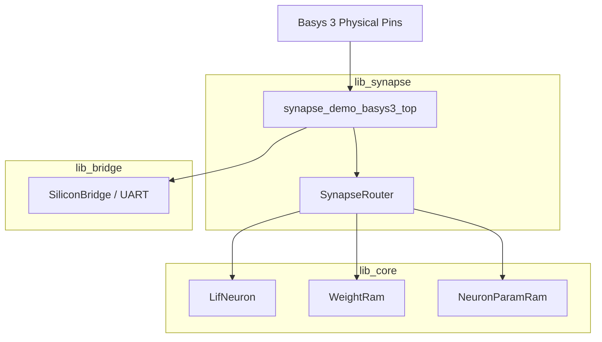
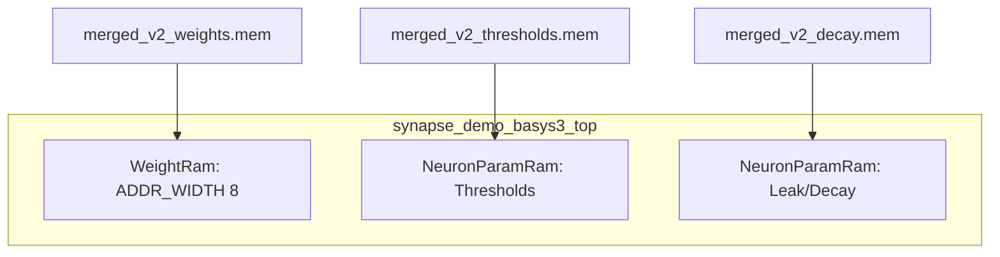

<details>
<summary>Relevant source files</summary>

The following files were used as context for generating this wiki page:

- [synapse-link-hdl/examples/basys3/Basys3_Top.sv](synapse-link-hdl/examples/basys3/Basys3_Top.sv)
- [AGENTS.md](AGENTS.md)
- [CLAUDE.md](CLAUDE.md)
- [README.md](README.md)
- [spikenaut-core-sv/mem/README.md](spikenaut-core-sv/mem/README.md)
</details>

# Synapse Demo Basys3 Wrapper

The **Synapse Demo Basys3 Wrapper** is a top-level SystemVerilog integration module designed specifically for the Digilent Basys 3 development board (Artix-7 FPGA). Its primary purpose is to serve as a demonstration platform for Address-Event Representation (AER) routing within the `lib_synapse` library, distinct from the primary Spikenaut SoC implementation.

This wrapper instantiates neuromorphic primitives and routing logic to showcase multi-neuron connectivity and synapse link functionality. It operates within a strictly deduplicated monorepo, ensuring that it only instantiates canonical modules from the `lib_core`, `lib_bridge`, and `lib_synapse` libraries without duplicating their underlying logic.

Sources: [README.md:14-36](README.md#L14-L36), [CLAUDE.md:46-51](CLAUDE.md#L46-L51), [AGENTS.md:73-77](AGENTS.md#L73-L77)

## Architecture and Hierarchy

The wrapper, named `synapse_demo_basys3_top`, serves as the entry point for the synapse-link demonstration. It integrates the `SynapseRouter` for event-based communication and coordinates with core SNN components.

### Component Integration
The architecture follows a fixed dependency order: `lib_bridge` → `lib_core` → `lib_synapse`. The wrapper acts as the final integration layer for the Basys 3 hardware targets.



*The diagram illustrates the hierarchical relationship where the Synapse Demo Wrapper integrates components from bridge, core, and synapse libraries.*

Sources: [CLAUDE.md:42-51](CLAUDE.md#L42-L51), [AGENTS.md:73-77](AGENTS.md#L73-L77), [README.md:21-36](README.md#L21-L36)

### Library Ownership
To maintain the "Single Source of Truth," this wrapper is strictly prohibited from containing local copies of library modules.

| Library | Path | Role in Wrapper |
|---|---|---|
| `lib_core` | `spikenaut-core-sv/rtl` | Provides `LifNeuron`, `WeightRam`, and `NeuronParamRam` |
| `lib_bridge` | `spikenaut-bridge-sv/rtl` | Provides `UartRx`, `UartTx`, and `SiliconBridge` for I/O |
| `lib_synapse` | `synapse-link-hdl/src` | Provides `SynapseRouter` for AER routing |

Sources: [CLAUDE.md:46-51](CLAUDE.md#L46-L51), [README.md:38-49](README.md#L38-L49)

## Memory and Parameter Initialization

The wrapper utilizes `.mem` files to initialize the internal RAM structures of the SNN components. These files follow the Q8.8 fixed-point format and are loaded during synthesis or simulation using `$readmemh`.

### Memory Initialization Flow
The initialization process involves loading specific datasets, currently utilizing the `merged_v2` profile, which represents a 16-neuron export.



*Initialization flow using $readmemh to populate neuron parameters within the Basys 3 wrapper.*

Sources: [spikenaut-core-sv/mem/README.md:5-20](spikenaut-core-sv/mem/README.md#L5-L20), [spikenaut-core-sv/mem/README.md:38-42](spikenaut-core-sv/mem/README.md#L38-L42)

### Parameter Configuration
| Component | Initialization File | Width/Depth |
|---|---|---|
| **WeightRam** | `merged_v2_weights.mem` | 16-bit Q8.8, 256 entries |
| **NeuronParamRam (Thresh)** | `merged_v2_thresholds.mem` | 16-bit Q8.8, 16 entries |
| **NeuronParamRam (Leak)** | `merged_v2_decay.mem` | 16-bit Q8.8, 16 entries |

Sources: [spikenaut-core-sv/mem/README.md:8-11](spikenaut-core-sv/mem/README.md#L8-L11), [spikenaut-core-sv/mem/README.md:38-45](spikenaut-core-sv/mem/README.md#L38-L45)

## Build and Implementation

The wrapper targets the Xilinx Artix-7 FPGA (`xc7a35tcpg236-1`) found on the Basys 3 board. Synthesis and implementation are managed via Vivado Tcl scripts that propagate generic parameters such as `INIT_FILE` paths.

### Synthesis Requirements
- **Constraints:** The build requires `constraints/basys3.xdc`.
- **Absolute Paths:** Vivado builds use absolute paths for `$readmemh` targets to ensure resolution regardless of the project directory location.
- **Generic Overrides:** Initialization files are passed via `synth_design -generic` (e.g., `WEIGHT_INIT_FILE`).

Sources: [AGENTS.md:28-30](AGENTS.md#L28-L30), [spikenaut-core-sv/mem/README.md:33-36](spikenaut-core-sv/mem/README.md#L33-L36), [README.md:28-31](README.md#L28-L31)

### Verification and Quality Control
The wrapper is subject to the **Deduplication Guardian**, which ensures that the `synapse_demo_basys3_top` module name remains distinct from the standard `spikenaut_soc_basys3_top`.

```bash
# Verify the uniqueness of the Synapse Demo Wrapper module
grep -R "module synapse_demo_basys3_top" . --include="*.sv" # Expect 1 hit
```

Sources: [README.md:65-66](README.md#L65-L66), [AGENTS.md:76-80](AGENTS.md#L76-L80)

## Conclusion
The `synapse_demo_basys3_top` wrapper is a critical component for evaluating address-event routing and multi-neuron connectivity in the `silicon-hdl` repository. By integrating canonical modules from across the monorepo while maintaining strict deduplication, it provides a stable hardware target for SNN experimentation on the Artix-7 platform.
