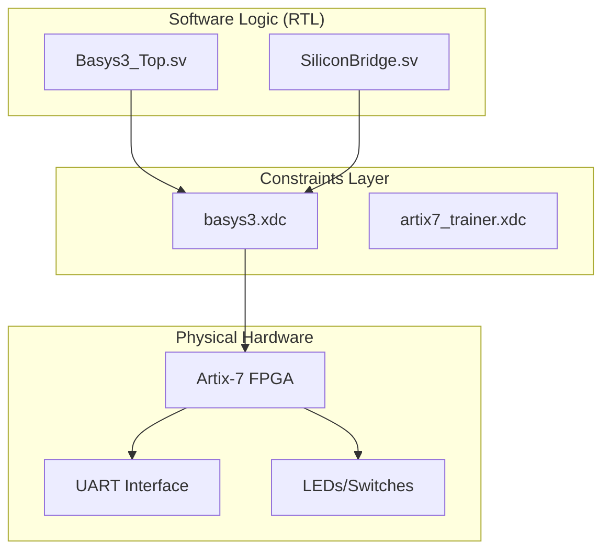
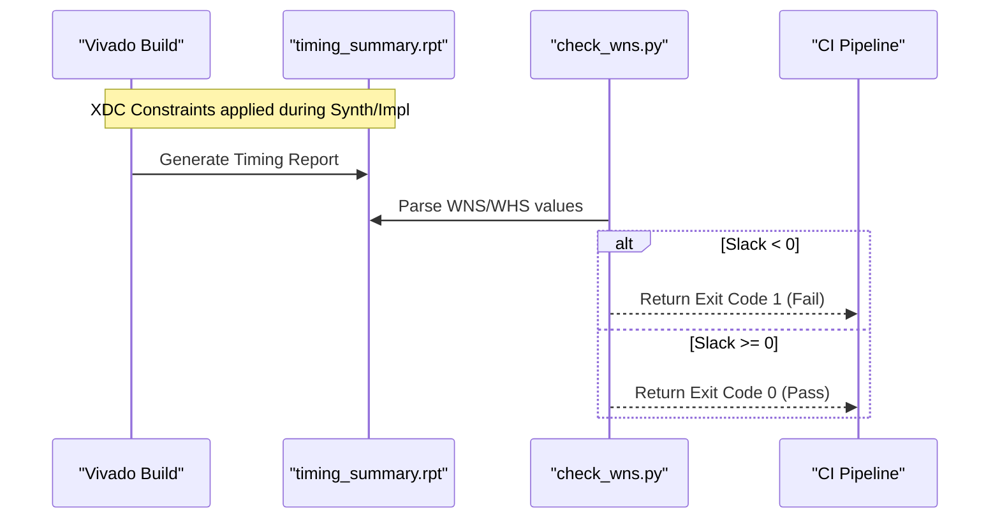

Relevant source files

The following files were used as context for generating this wiki page:

- [constraints/basys3.xdc](constraints/basys3.xdc)
- [constraints/artix7_trainer.xdc](constraints/artix7_trainer.xdc)
- [README.md](README.md)
- [AGENTS.md](AGENTS.md)
- [CLAUDE.md](CLAUDE.md)
- [scripts/check_wns.py](scripts/check_wns.py)

# FPGA Pin Constraints (XDC)

## Introduction

FPGA Pin Constraints within the `silicon-hdl` project define the physical mapping and timing requirements for neuromorphic and spiking neural network (SNN) primitives implemented on Xilinx hardware. These constraints are primarily contained in Xilinx Design Constraints (XDC) files, which bridge the gap between abstract SystemVerilog Register Transfer Level (RTL) logic and the physical hardware of the target device. The project specifically targets the Digilent Basys 3 board, utilizing the Artix-7 FPGA (`xc7a35tcpg236-1`).

The constraints ensure that signals such as the system clock, UART communication lines, and neuromorphic I/O (switches and LEDs) are correctly routed to the appropriate pins on the Artix-7 package. Furthermore, these files establish the timing boundaries necessary for stable operation, which are later verified by automated scripts during the build process.

Sources: [README.md:5-7](README.md#L5-L7), [CLAUDE.md:31-33](CLAUDE.md#L31-L33), [constraints/basys3.xdc](constraints/basys3.xdc)

## Hardware Mapping and I/O Configuration

The project utilizes XDC files to map top-level module ports to physical package pins. The primary target is the Basys 3 development board, though generic Artix-7 trainer board constraints are also maintained. These mappings include basic board peripherals used for interacting with the Spikenaut SoC and Synapse Router demos.

### Target Device and Package
The silicon-hdl monorepo is optimized for the following hardware specifications:
- **FPGA:** Artix-7
- **Part Number:** `xc7a35tcpg236-1`
- **Development Board:** Digilent Basys 3

Sources: [README.md:7](README.md#L7), [CLAUDE.md:31-33](CLAUDE.md#L31-L33)

### Logical to Physical Connectivity
The constraints manage several categories of I/O required for the neuromorphic SoC:

| Peripheral Category | Function | Usage in silicon-hdl |
|---|---|---|
| **System Clock** | Timing reference | Primary 100MHz clock source |
| **UART (Rx/Tx)** | Communication | Used by `SiliconBridge` for host-FPGA data exchange |
| **Switches** | User Input | Configuration and stimulus for SNN modules |
| **LEDs** | Visual Feedback | Monitoring neuron spikes and system status |

Sources: [constraints/basys3.xdc](constraints/basys3.xdc), [CLAUDE.md:39-44](CLAUDE.md#L39-L44), [README.md:25-33](README.md#L25-L33)

The following diagram illustrates the relationship between the constraints, the build tools, and the physical hardware.

This diagram shows how SystemVerilog modules rely on XDC constraints to interface with the physical Artix-7 FPGA pins.
Sources: [README.md:25-33](README.md#L25-L33), [constraints/basys3.xdc](constraints/basys3.xdc)

## Timing Constraints and Verification

Timing constraints are critical for ensuring that the synthesized SNN primitives meet the required clock frequencies on the Artix-7 fabric. The XDC files define the period, waveform, and uncertainty for the primary system clock.

### Timing Gates and Slack Analysis
During the implementation phase, Vivado generates a timing summary report. The `silicon-hdl` project includes a specialized script, `scripts/check_wns.py`, to verify that the design adheres to the constraints defined in the XDC files.

- **WNS (Worst Negative Slack):** Must be above zero to ensure setup timing is met.
- **WHS (Worst Hold Slack):** Must be above zero to ensure hold timing is met.

Sources: [scripts/check_wns.py:7-13](scripts/check_wns.py#L7-L13)

This sequence illustrates the automated timing verification flow used to enforce constraints.
Sources: [scripts/check_wns.py:76-102](scripts/check_wns.py#L76-L102), [AGENTS.md:18-24](AGENTS.md#L18-L24)

## Project Integration

XDC files are integrated into the Vivado build flow through Tcl scripts. The `scripts/build_soc.tcl` script is responsible for sourcing these constraints during the synthesis and implementation of the Spikenaut SoC.

- **Location:** All constraints are centralized in the `constraints/` directory.
- **Top-Level Targets:** Constraints apply to `spikenaut_soc_basys3_top` and `synapse_demo_basys3_top`.
- **License Requirement:** All XDC files carry the dual MIT / Apache-2.0 SPDX header.

Sources: [README.md:25-33](README.md#L25-L33), [AGENTS.md:73-77](AGENTS.md#L73-L77), [CHANGELOG.md:19-21](CHANGELOG.md#L19-L21)

## Conclusion

The FPGA Pin Constraints (XDC) serve as the essential configuration layer for the `silicon-hdl` project, ensuring that the SystemVerilog SNN primitives operate correctly on Artix-7 hardware. By defining specific pin assignments for communication and user I/O, and establishing rigorous timing boundaries, these constraints allow the neuromorphic logic to interface reliably with the physical environment of the Basys 3 board.
