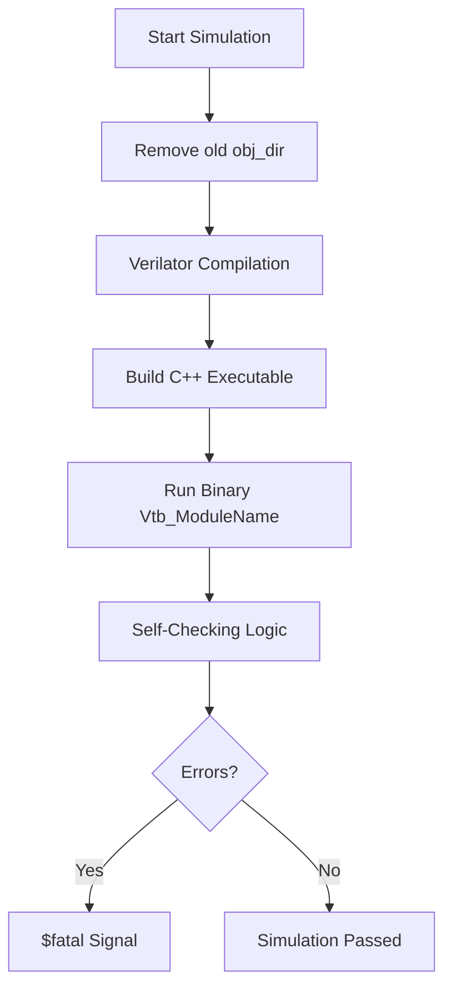
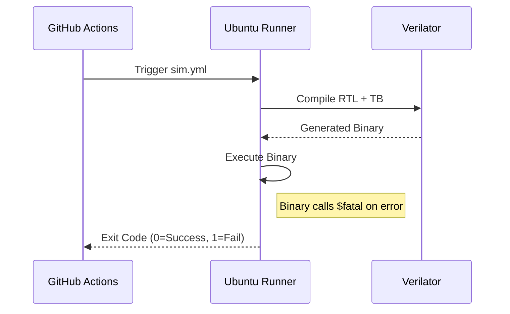

<details>
<summary>Relevant source files</summary>

The following files were used as context for generating this wiki page:

- [AGENTS.md](AGENTS.md)
- [CLAUDE.md](CLAUDE.md)
- [README.md](README.md)
- [CHANGELOG.md](CHANGELOG.md)
- [scripts/quality.sh](scripts/quality.sh)
- [spikenaut-core-sv/mem/README.md](spikenaut-core-sv/mem/README.md)
</details>

# Verilator Unit Simulation

Verilator Unit Simulation serves as the primary iteration and quality assurance tool for the `silicon-hdl` monorepo. It provides a fast, "free-stack" Register Transfer Level (RTL) simulation environment that does not require proprietary licenses, such as Xilinx Vivado, for local development and Continuous Integration (CI). The simulation focus is on the `lib_core` primitives, including Leaky Integrate-and-Fire (LIF) neurons and associated memory controllers.
Sources: [AGENTS.md:14-22](AGENTS.md#L14-L22), [CLAUDE.md:27-31](CLAUDE.md#L27-L31), [README.md:10-15](README.md#L10-L15)

The simulation framework is designed to validate individual modules within the neuromorphic core before they are integrated into larger System-on-Chip (SoC) wrappers or routing architectures. It utilizes SystemVerilog testbenches that drive stimulus and sample outputs, enforcing a convention where signals are manipulated on the falling edge (`negedge`) of the clock to avoid race conditions with the design under test (DUT).
Sources: [AGENTS.md:78-80](AGENTS.md#L78-L80), [README.md:26-32](README.md#L26-L32)

## Simulation Architecture and Flow

The simulation flow involves compiling SystemVerilog RTL and testbench files into a binary executable using Verilator. This process bypasses the overhead of full synthesis and implementation required by FPGA vendor tools, allowing for rapid iteration cycles.

### Simulation Process Flow



The diagram shows the sequential steps taken by the simulation scripts to prepare and execute unit tests.
Sources: [AGENTS.md:38-46](AGENTS.md#L38-L46), [scripts/quality.sh:65-74](scripts/quality.sh#L65-L74)

### Core Components for Simulation

The following table summarizes the primary core modules and their corresponding testbench sources used during Verilator simulation:

| Top Module | RTL Source | Testbench Source |
|---|---|---|
| `tb_LifNeuron` | `spikenaut-core-sv/rtl/LifNeuron.sv` | `spikenaut-core-sv/tb/tb_LifNeuron.sv` |
| `tb_WeightRam` | `spikenaut-core-sv/rtl/WeightRam.sv` | `spikenaut-core-sv/tb/tb_WeightRam.sv` |
| `tb_NeuronParamRam` | `spikenaut-core-sv/rtl/NeuronParamRam.sv` | `spikenaut-core-sv/tb/tb_NeuronParamRam.sv` |
| `tb_StdpController` | `spikenaut-core-sv/rtl/StdpController.sv` | `spikenaut-core-sv/tb/tb_StdpController.sv` |

Sources: [AGENTS.md:52-57](AGENTS.md#L52-L57), [scripts/quality.sh:61-63](scripts/quality.sh#L61-L63)

## Simulation Configuration and Execution

Simulation behavior is controlled through specific Verilator flags and automated scripts. The project utilizes a `quality.sh` script to orchestrate the execution of all core testbenches.

### Verilator Flags
To ensure compatibility and correct timing behavior, the following flags are used:
- `--binary`: Compiles the design into a simulation executable.
- `--timing`: Enables support for SystemVerilog timing constructs.
- `-Wno-WIDTHEXPAND`, `-Wno-DECLFILENAME`, `-Wno-TIMESCALEMOD`: Suppresses specific non-critical warnings common in SystemVerilog development.
- `-I<path>`: Sets the include directory for RTL dependencies.

Sources: [AGENTS.md:38-41](AGENTS.md#L38-L41), [scripts/quality.sh:58](scripts/quality.sh#L58)

### Automated Quality Checks
The `scripts/quality.sh` script serves as the local entrypoint for quality assurance, running the Deduplication Guardian before proceeding to Verilator simulations.

```bash
# Example Verilator execution for the LifNeuron module
verilator --binary --timing -Wno-WIDTHEXPAND -Wno-DECLFILENAME -Wno-TIMESCALEMOD \
  --top-module tb_LifNeuron \
  -Ispikenaut-core-sv/rtl \
  spikenaut-core-sv/rtl/LifNeuron.sv \
  spikenaut-core-sv/tb/tb_LifNeuron.sv
./obj_dir/Vtb_LifNeuron
```

Sources: [AGENTS.md:38-46](AGENTS.md#L38-L46), [scripts/quality.sh:64-77](scripts/quality.sh#L64-L77)

## Memory Initialization in Simulation

Unit simulations utilize `$readmemh` to initialize RAM modules with neuromorphic weights and parameters. During simulation, these paths are resolved relative to the repository root.

### Memory Image Configuration

| Parameter | Default Value | Simulation Context |
|---|---|---|
| `INIT_FILE` | `"NONE"` | Path to `.mem` file (e.g., `spikenaut-core-sv/mem/merged_v2_weights.mem`) |
| `ADDR_WIDTH` | `8` or `10` | Must match the number of lines in the `.mem` file to avoid truncation. |

Sources: [spikenaut-core-sv/mem/README.md:15-18, 30-32](spikenaut-core-sv/mem/README.md#L15-L18)

Verilator simulation environments use typed `string` parameters for `INIT_FILE` to prevent path override issues common with untyped parameters. If a file path is invalid, simulations include a `$fopen` precheck (restricted to `ifndef SYNTHESIS`) that fails loudly to aid debugging.
Sources: [spikenaut-core-sv/mem/README.md:16-18](spikenaut-core-sv/mem/README.md#L16-L18)

## Continuous Integration (CI) Integration

Verilator unit simulations are integrated into the GitHub Actions workflow (`.github/workflows/sim.yml`). This ensures that every `push` to the main branch and every `pull_request` passes basic functional verification without requiring a self-hosted Vivado runner.

### CI Workflow Logic



The sequence diagram illustrates the CI pipeline's reliance on Verilator to validate PRs.
Sources: [CHANGELOG.md:21-27](CHANGELOG.md#L21-L27), [AGENTS.md:38-46](AGENTS.md#L38-L46)

## Summary

Verilator Unit Simulation provides the foundational verification layer for `silicon-hdl`. By focusing on core SNN primitives and utilizing self-checking testbenches, it enables rapid development and ensures that canonical RTL modules remain functional across updates. The integration of memory initialization and strict deduplication checks further reinforces the project's single-source-of-truth architecture.
Sources: [AGENTS.md:14-22](AGENTS.md#L14-L22), [CLAUDE.md:27-31](CLAUDE.md#L27-L31), [CHANGELOG.md:21-32](CHANGELOG.md#L21-L32)
