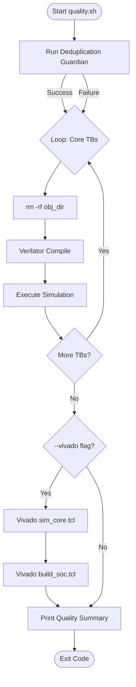

<details>
<summary>Relevant source files</summary>

The following files were used as context for generating this wiki page:

- [scripts/quality.sh](scripts/quality.sh)
- [scripts/dedup_guardian.py](scripts/dedup_guardian.py)
- [AGENTS.md](AGENTS.md)
- [CLAUDE.md](CLAUDE.md)
- [README.md](README.md)
- [CHANGELOG.md](CHANGELOG.md)
</details>

# Local QA Workflow (quality.sh)

The Local QA Workflow is a "free-stack" quality entrypoint designed for local development iteration. Its primary purpose is to consolidate deduplication checks and Verilator-based unit testing into a single command, ensuring that changes to the SystemVerilog monorepo adhere to structural purity and functional correctness before being committed. 

Sources: [scripts/quality.sh:3-5](scripts/quality.sh#L3-L5), [AGENTS.md:14-16](AGENTS.md#L14-L16)

This workflow serves as the local counterpart to the project's Continuous Integration (CI) pipeline. While CI runs on every push and pull request, `quality.sh` allows developers to validate the "single-source-of-truth" library layout and core RTL modules without requiring a Vivado license, though it provides optional hooks for Vivado-based simulation and synthesis if the tool is available.

Sources: [CLAUDE.md:43-46](CLAUDE.md#L43-L46), [CHANGELOG.md:27-30](CHANGELOG.md#L27-L30)

## Workflow Architecture and Execution

The workflow is implemented as a Bash script that orchestrates multiple validation tools. It follows a sequential execution pattern, recording the success or failure of each stage to produce a final quality summary.

### Execution Flow
The following diagram illustrates the sequential stages of the `quality.sh` execution:



The workflow ensures isolation between testbenches by removing the `obj_dir` before each Verilator build to prevent symbol conflicts.
Sources: [scripts/quality.sh:75-84](scripts/quality.sh#L75-L84), [AGENTS.md:40-43](AGENTS.md#L40-L43)

## Key Components

### 1. Deduplication Guardian
The first check performed is the `dedup_guardian.py` script. This tool enforces the repository's strict "single-source-of-truth" rule by scanning for duplicate module definitions and calculating a "Purity Score." It ensures that every RTL module, such as `LifNeuron` or `WeightRam`, exists only in its canonical location.

Sources: [scripts/quality.sh:64-69](scripts/quality.sh#L64-L69), [scripts/dedup_guardian.py:10-18](scripts/dedup_guardian.py#L10-L18), [README.md:45-51](README.md#L45-L51)

### 2. Verilator Unit Testing
The core of the local QA process involves running four primary unit testbenches using Verilator. These tests are "free-stack," meaning they do not require proprietary FPGA vendor tools.

| Testbench Top | Device Under Test (DUT) | Description |
|---|---|---|
| `tb_LifNeuron` | `LifNeuron.sv` | Leaky Integrate-and-Fire neuron logic |
| `tb_WeightRam` | `WeightRam.sv` | Weight memory management |
| `tb_NeuronParamRam` | `NeuronParamRam.sv` | Threshold and leak parameter storage |
| `tb_StdpController` | `StdpController.sv` | Spike-timing-dependent plasticity logic |

Sources: [scripts/quality.sh:76-81](scripts/quality.sh#L76-L81), [AGENTS.md:45-51](AGENTS.md#L45-L51)

### 3. Optional Vivado Integration
When invoked with the `--vivado` flag, the script attempts to run hardware-specific flows. This requires the user to have sourced the Xilinx environment (e.g., `source ~/Xilinx/env.sh`).

*  **sim_core.tcl**: Runs all core unit testbenches within the Vivado simulator.
*  **build_soc.tcl**: Performs synthesis, implementation, and bitstream generation for the Basys 3 target (Artix-7).

Sources: [scripts/quality.sh:98-118](scripts/quality.sh#L98-L118), [AGENTS.md:55-58](AGENTS.md#L55-L58)

## Configuration and Flags

The script supports specific command-line arguments to modify its behavior.

| Argument | Description |
|---|---|
| (No args) | Runs Deduplication Guardian and all four core Verilator testbenches. |
| `--vivado` | Includes Vivado-based simulation and SoC build implementation. |
| `-h`, `--help` | Displays usage information derived from the script's header. |

Sources: [scripts/quality.sh:8-12](scripts/quality.sh#L8-L12), [scripts/quality.sh:23-34](scripts/quality.sh#L23-L34)

## Implementation Details

The script uses a set of standard Verilator flags to maintain consistency with the CI environment:

```bash
--binary --timing -Wno-WIDTHEXPAND -Wno-DECLFILENAME -Wno-TIMESCALEMOD
```

These flags enable timing-aware simulation while suppressing specific non-critical warnings relevant to the `silicon-hdl` codebase.

Sources: [scripts/quality.sh:71](scripts/quality.sh#L71), [AGENTS.md:33-35](AGENTS.md#L33-L35)

The final "Quality Summary" output provides a clear pass/fail tally for each module tested, exiting with code `1` if any component fails, which allows it to be used in local pre-commit hooks or automated scripts.

Sources: [scripts/quality.sh:122-132](scripts/quality.sh#L122-L132)

## Summary
The `quality.sh` script is the central orchestrator for maintaining code health in the `silicon-hdl` project. By combining structural validation via the Deduplication Guardian with functional verification through Verilator and Vivado, it ensures that the neuromorphic primitives remain deduplicated and technically sound across different simulation environments.
