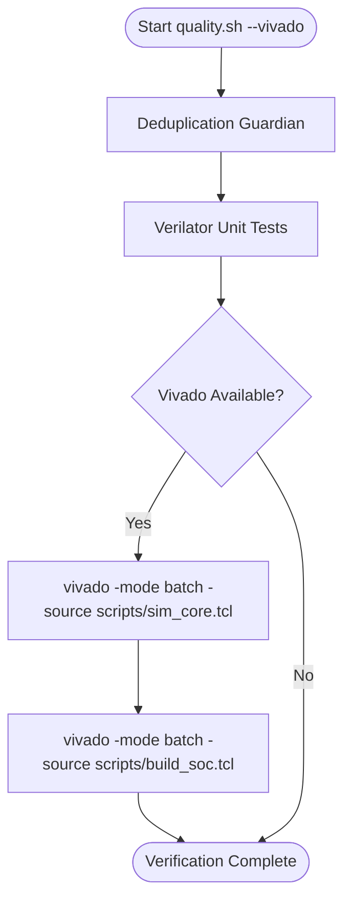
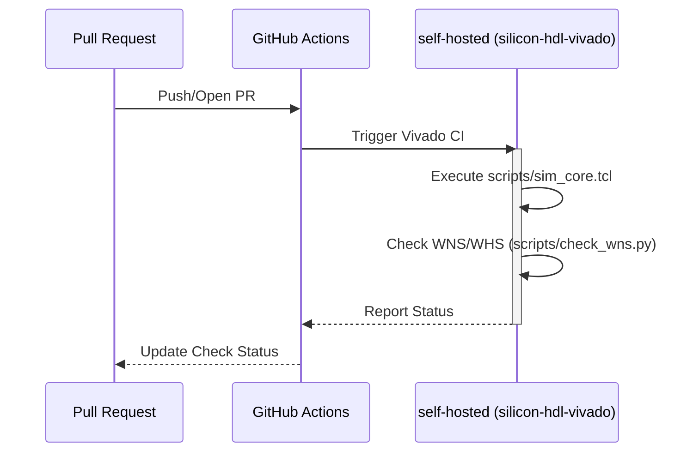

Relevant source files

The following files were used as context for generating this wiki page:

- [scripts/sim_core.tcl](scripts/sim_core.tcl)
- [AGENTS.md](AGENTS.md)
- [README.md](README.md)
- [CLAUDE.md](CLAUDE.md)
- [scripts/quality.sh](scripts/quality.sh)
- [spikenaut-core-sv/mem/README.md](spikenaut-core-sv/mem/README.md)

# Vivado Simulation

Vivado Simulation provides the primary verification path for the `silicon-hdl` project's Spiking Neural Network (SNN) primitives and System-on-Chip (SoC) wrappers. While the project uses Verilator for rapid local iteration, Vivado simulation is utilized for high-fidelity verification of register-transfer-level (RTL) logic, ensuring compatibility with Xilinx Artix-7 hardware and serving as a gate for synthesis and bitstream generation.

The simulation environment is automated via Tcl scripting, specifically targeting core neuromorphic modules such as Leaky Integrate-and-Fire (LIF) neurons and associated memory controllers. It operates in a batch-mode environment to facilitate Continuous Integration (CI) and local quality checks through specialized shell scripts.

Sources: [AGENTS.md:32-34](AGENTS.md#L32-L34), [README.md:15-17](README.md#L15-L17), [CLAUDE.md:28-30](CLAUDE.md#L28-L30)

## Simulation Architecture and Flow

The simulation workflow is designed to validate the canonical single-source-of-truth modules located in `lib_core`. The process follows a strict dependency order where communication primitives (`lib_bridge`) and core logic (`lib_core`) are verified before integration into SoC wrappers.

### Simulation Execution Flow
The following diagram illustrates the lifecycle of a Vivado simulation run as initiated by the project's quality scripts.

The simulation utilizes batch mode to execute Tcl scripts without a Graphical User Interface, capturing results in logs and journals.
Sources: [scripts/quality.sh:78-95](scripts/quality.sh#L78-L95), [AGENTS.md:14-17](AGENTS.md#L14-L17)

## Core Simulation Components

### Target Modules and Testbenches
The simulation environment targets specific core unit testbenches. While `scripts/sim_core.tcl` automatically discovers testbench files under `spikenaut-core-sv/tb` via globbing, the top-level module names must be explicitly defined in the `core_tb_tops` list.

| Component | DUT Path | Testbench Top | Description |
|---|---|---|---|
| LIF Neuron | `spikenaut-core-sv/rtl/LifNeuron.sv` | `tb_LifNeuron` | Verifies integrate-and-fire spike logic |
| Weight RAM | `spikenaut-core-sv/rtl/WeightRam.sv` | `tb_WeightRam` | Validates synaptic weight storage and retrieval |
| Neuron Param RAM | `spikenaut-core-sv/rtl/NeuronParamRam.sv` | `tb_NeuronParamRam` | Validates threshold and decay rate memory |
| STDP Controller | `spikenaut-core-sv/rtl/StdpController.sv` | `tb_StdpController` | Verifies Spike-Timing-Dependent Plasticity logic |

Sources: [AGENTS.md:52-58](AGENTS.md#L52-L58), [README.md:46-56](README.md#L46-L56), [scripts/quality.sh:58-63](scripts/quality.sh#L58-L63)

### Memory Initialization in Simulation
Vivado simulation handles memory initialization differently than synthesis. Hexadecimal `.mem` files are used to load weights and parameters into BRAM primitives using the `$readmemh` system task.

- **Initialization Files**: Active profiles like `merged_v2_weights.mem` (256 entries) and `merged_v2_thresholds.mem` (16 entries) are loaded.
- **Path Resolution**: During simulation, paths passed to `INIT_FILE` parameters are relative to the repo root. In `scripts/build_soc.tcl`, absolute paths are passed via `synth_design -generic` to ensure resolution regardless of the working directory.
- **Tool Behavior**: A `$fopen` precheck is used in RTL (wrapped in `` `ifndef SYNTHESIS ``) to fail simulation loudly if memory images are missing.

Sources: [spikenaut-core-sv/mem/README.md:16-30](spikenaut-core-sv/mem/README.md#L16-L30), [spikenaut-core-sv/mem/README.md:39-44](spikenaut-core-sv/mem/README.md#L39-L44)

## Simulation Configuration

### Tcl Scripting Interface
The `scripts/sim_core.tcl` script is the primary entry point for core unit simulations. It performs the following operations:
1. Hardcodes RTL source-file lists to maintain single-source-of-truth integrity.
2. Discovers testbench files via globbing.
3. Sets the simulation top module from the `core_tb_tops` list.
4. Executes the simulation in batch mode.

### Continuous Integration (CI)
Vivado simulation is integrated into a self-hosted CI pipeline.

The runner is labeled `silicon-hdl-vivado` and runs on self-hosted hardware due to licensing requirements.
Sources: [AGENTS.md:21-27](AGENTS.md#L21-L27), [scripts/check_wns.py:1-5](scripts/check_wns.py#L1-L5)

## Timing Verification
A critical post-simulation/synthesis step involves checking timing slacks. The script `scripts/check_wns.py` is used to parse `timing_summary.rpt` generated during the Vivado flow to ensure the design meets its constraints.

- **WNS**: Worst Negative Slack. Must be $\ge 0$ ns.
- **WHS**: Worst Hold Slack. Must be $\ge 0$ ns.

If either value is negative, the verification gate fails, preventing faulty logic from being deployed to the Artix-7 hardware.
Sources: [scripts/check_wns.py:59-86](scripts/check_wns.py#L59-L86)

## Summary
Vivado Simulation in the `silicon-hdl` project provides a robust verification layer that complements Verilator. By utilizing Tcl-driven automation and strictly defined canonical source paths, the system ensures that complex neuromorphic primitives are validated against Artix-7 timing and memory constraints before hardware deployment.
