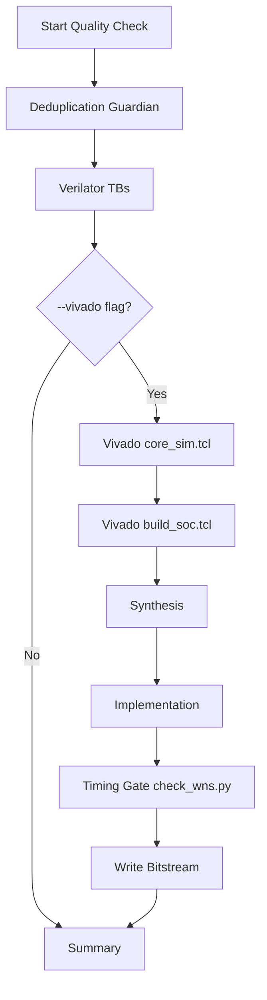

<details>
<summary>Relevant source files</summary>

The following files were used as context for generating this wiki page:

- [scripts/build\_soc.tcl](scripts/build_soc.tcl)
- [scripts/quality.sh](scripts/quality.sh)
- [scripts/check\_wns.py](scripts/check_wns.py)
- [CLAUDE.md](CLAUDE.md)
- [AGENTS.md](AGENTS.md)
- [README.md](README.md)
</details>

# Vivado Synthesis & Implementation

The silicon-hdl project utilizes Xilinx Vivado as the primary toolchain for synthesizing, implementing, and generating bitstreams for neuromorphic primitives. While Verilator is preferred for rapid simulation and iterative testing, Vivado provides the definitive path for hardware bring-up on the Digilent Basys 3 development board, which features an Artix-7 FPGA (`xc7a35tcpg236-1`).

Sources: [CLAUDE.md:46-48](CLAUDE.md#L46-L48), [README.md:1-5](README.md#L1-L5)

The synthesis and implementation processes are automated via Tool Command Language (TCL) scripts, specifically `build_soc.tcl` for the System-on-Chip (SoC) integration and `sim_core.tcl` for unit-level simulation within the Vivado environment. These scripts manage the registration of SystemVerilog RTL files, application of physical constraints, and the execution of the FPGA compilation flow from netlist generation to bitstream export.

Sources: [AGENTS.md:65-67](AGENTS.md#L65-L67), [README.md:67-73](README.md#L67-L73)

## Build Pipeline Architecture

The build pipeline follows a strictly ordered dependency sequence to ensure library consistency. Modules are sourced from four primary libraries: `lib_bridge`, `lib_core`, `lib_soc`, and `lib_synapse`. 

Sources: [CLAUDE.md:49-56](CLAUDE.md#L49-L56), [AGENTS.md:85-87](AGENTS.md#L85-L87)

### Execution Flow
The standard synthesis and implementation flow is initiated using the `quality.sh` script with the `--vivado` flag, or by invoking Vivado in batch mode directly.



The diagram shows the integration of Vivado tools within the broader project quality and build flow.
Sources: [scripts/quality.sh:42-101](scripts/quality.sh#L42-L101), [AGENTS.md:14-19](AGENTS.md#L14-L19)

## Automated Scripts and Tools

### build_soc.tcl
This script is the central orchestrator for the hardware build. It hardcodes RTL source-file lists and performs the following operations:
*  **Project Initialization:** Sets target parts and library structures.
*  **RTL Sourcing:** Reads SystemVerilog files from canonical library paths.
*  **Generic Configuration:** Passes absolute paths for memory initialization files (e.g., `WEIGHT_INIT_FILE`) to the synthesis engine via `synth_design -generic`.
*  **Design Flow:** Executes `synth_design`, `opt_design`, `place_design`, `route_design`, and `write_bitstream`.

Sources: [AGENTS.md:65-75](AGENTS.md#L65-L75), [spikenaut-core-sv/mem/README.md:29-33](spikenaut-core-sv/mem/README.md#L29-L33)

### check_wns.py (Timing Gate)
A specialized Python utility used to validate timing closure after implementation. It parses the Vivado `timing_summary.rpt` to ensure the design meets performance requirements.

| Metric | Full Name | Description |
|---|---|---|
| WNS | Worst Negative Slack | Must be ≥ 0. Represents the worst-case setup time margin. |
| WHS | Worst Hold Slack | Must be ≥ 0. Represents the worst-case hold time margin. |

Sources: [scripts/check_wns.py:1-12](scripts/check_wns.py#L1-L12)

### quality.sh
The local entrypoint for quality assurance. It sequences the Deduplication Guardian, Verilator simulations, and Vivado builds.

```bash
# Example usage to trigger Vivado flow
./scripts/quality.sh --vivado
```

Sources: [scripts/quality.sh:1-10](scripts/quality.sh#L1-L10)

## Memory and Parameter Initialization

During synthesis, Vivado handles the initialization of Block RAM (BRAM) for neurons and weights. The project uses `$readmemh` to load `.mem` files.

*  **Initialization Flow:** For synthesis, Vivado resolves initialization paths provided through TCL generics.
*  **Data Formats:** Parameter files use one 16-bit Q8.8 hex word per line.
*  **Target Instances:** The `spikenaut_soc_basys3_top` wires specific images to RTL instances:
  *  `u_wram`: Initialized with `merged_v2_weights.mem`.
  *  `u_npram_threshold`: Initialized with `merged_v2_thresholds.mem`.
  *  `u_npram_leak`: Initialized with `merged_v2_decay.mem`.

Sources: [spikenaut-core-sv/mem/README.md:7-14](spikenaut-core-sv/mem/README.md#L7-L14), [spikenaut-core-sv/mem/README.md:29-41](spikenaut-core-sv/mem/README.md#L29-L41)

## Constraints and Hardware Mapping

The implementation phase maps the synthesized netlist to the Artix-7 architecture using Xilinx Design Constraints (XDC) files.

| File Path | Description |
|---|---|
| `constraints/basys3.xdc` | Primary pin mappings and timing constraints for the Basys 3 board. |
| `constraints/artix7_trainer.xdc` | Alternative or supplemental constraints for Artix-7 training environments. |

Sources: [README.md:43-45](README.md#L43-L45), [CLAUDE.md:46-48](CLAUDE.md#L46-L48)

## Conclusion

Vivado Synthesis & Implementation forms the critical final stage of the silicon-hdl development pipeline. By leveraging TCL-based automation and a Python-driven timing gate, the project ensures that neuromorphic primitives are not only functionally correct in simulation but also physically viable and timing-closed for deployment on Artix-7 FPGA hardware.
