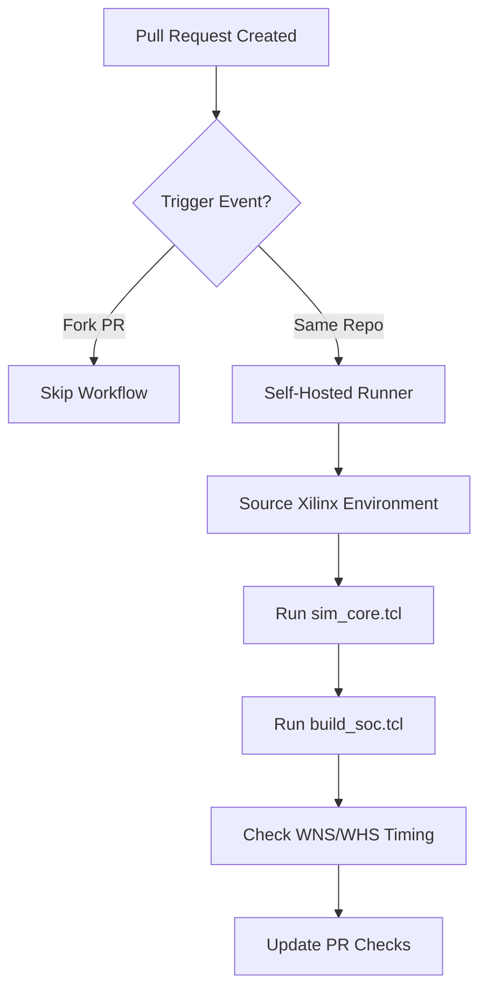
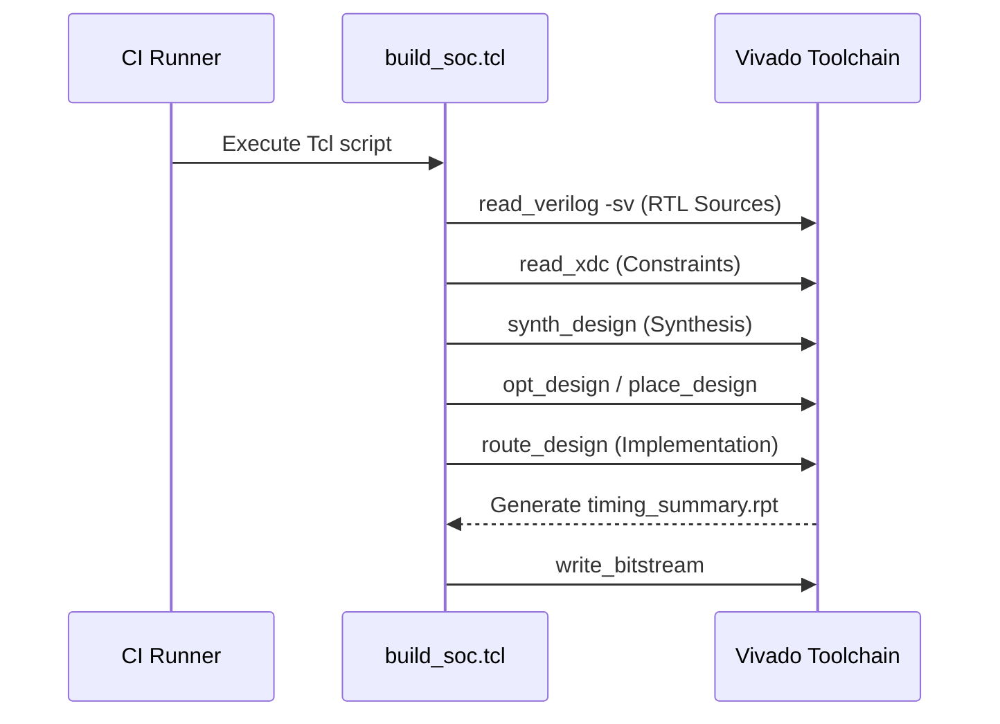
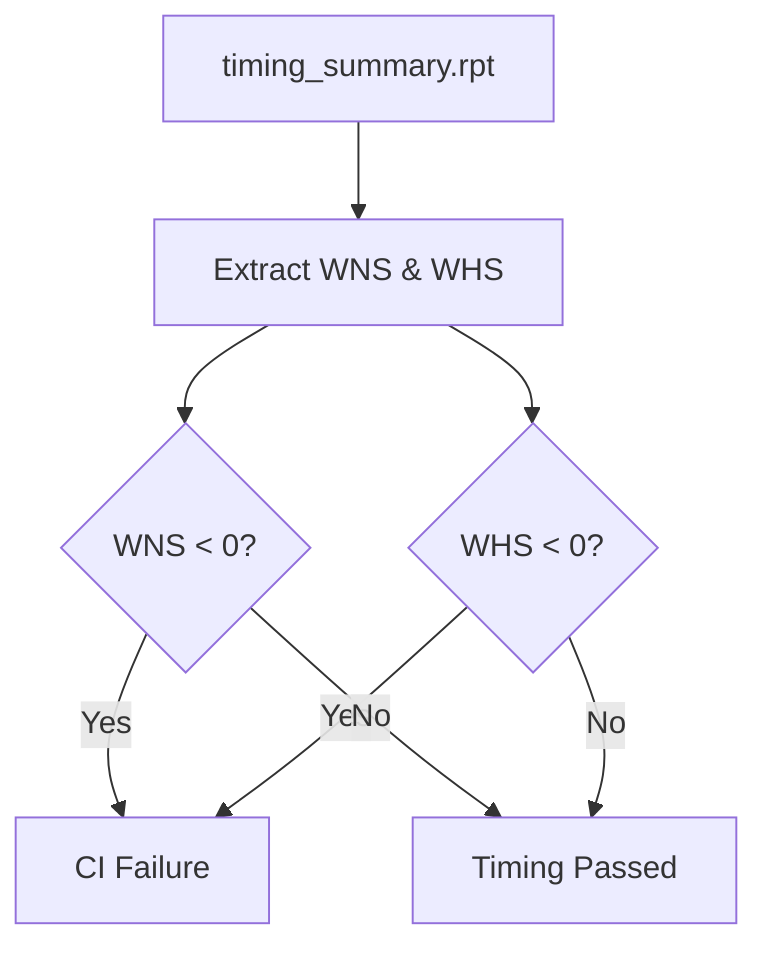

<details>
<summary>Relevant source files</summary>

The following files were used as context for generating this wiki page:

- [AGENTS.md](AGENTS.md)
- [CLAUDE.md](CLAUDE.md)
- [README.md](README.md)
- [scripts/quality.sh](scripts/quality.sh)
- [scripts/check_wns.py](scripts/check_wns.py)
</details>

# Self-Hosted Vivado CI

The Self-Hosted Vivado Continuous Integration (CI) system provides a specialized pipeline for hardware synthesis, implementation, and bitstream generation within the `silicon-hdl` project. Because Vivado licenses are not assumed to be available on standard GitHub-hosted runners or local environments, this CI path is reserved for a dedicated self-hosted runner environment that possesses the necessary Xilinx toolchain and licenses.

The primary purpose of this system is to validate that Register-Transfer Level (RTL) changes remain compatible with Xilinx FPGA hardware, specifically targeting the Artix-7 (Basys 3) platform. It complements the "free-stack" Verilator CI by providing deep hardware-specific checks such as timing closure verification and resource utilization.

Sources: [AGENTS.md:18-20](AGENTS.md#L18-L20), [CLAUDE.md:27-28](CLAUDE.md#L27-L28), [README.md:1-5](README.md#L1-L5)

## CI Architecture and Workflow

The Vivado CI workflow is managed via GitHub Actions but executes on a specific self-hosted infrastructure. Unlike the Verilator-based simulation which runs on every push, the Vivado CI is designed to avoid being a "free-runner" required check due to the licensing and resource constraints of FPGA synthesis.

### Workflow Triggers and Security
The workflow resides in `.github/workflows/vivado-ci.yml` and is triggered by:
- Same-repository pull requests (`opened`, `synchronize`, `reopened`, `ready_for_review`).
- Manual triggers via the GitHub Actions "Run workflow" button.

To prevent unauthorized resource usage or malicious code execution on the self-hosted runner, fork PRs are skipped unless they are from the same repository. The system relies on the "Require approval for all outside collaborators" setting for security.

Sources: [AGENTS.md:22-31](AGENTS.md#L22-L31)

### Runner Configuration
The runner is identified by specific labels and a local path on the host machine.

| Attribute | Value |
|---|---|
| Labels | `self-hosted`, `vivado` |
| Runner Name | `silicon-hdl-vivado` |
| Local Path | `~/actions-runner/silicon-hdl-runner` |

Sources: [AGENTS.md:33](AGENTS.md#L33)

### Logical Flow
The following diagram illustrates the lifecycle of a Vivado CI run:



The diagram shows the conditional triggering logic and the sequence of Xilinx tool executions on the self-hosted runner.
Sources: [AGENTS.md:22-31](AGENTS.md#L22-L31), [scripts/quality.sh:86-103](scripts/quality.sh#L86-L103)

## Synthesis and Implementation

The CI system utilizes Tcl scripts to automate the Vivado hardware development lifecycle. This includes unit-level simulation and the full implementation of the System-on-Chip (SoC) wrapper.

### Core Simulation
The `scripts/sim_core.tcl` script is used to run all core unit testbenches within the Vivado environment. While Verilator is preferred for fast iteration, Vivado simulation provides a secondary check for tool-specific behavior. New testbenches under `spikenaut-core-sv/tb` are discovered automatically via globbing, but their top module names must be added to the `core_tb_tops` list in the Tcl script.

Sources: [AGENTS.md:61-68](AGENTS.md#L61-L68), [scripts/quality.sh:91-95](scripts/quality.sh#L91-L95)

### SoC Build Pipeline
The `scripts/build_soc.tcl` script performs the heavy lifting of FPGA implementation. It targets the Basys 3 board (`xc7a35tcpg236-1`).



The build process involves reading fixed RTL lists, synthesizing logic, and performing physical implementation to generate a bitstream.
Sources: [AGENTS.md:61-65](AGENTS.md#L61-L65), [scripts/quality.sh:97-101](scripts/quality.sh#L97-L101)

## Timing Verification Gate

A critical component of the Vivado CI is the timing gate, which prevents the merging of designs that fail to meet physical timing requirements on the target FPGA.

### WNS/WHS Validation
The `scripts/check_wns.py` script parses the `timing_summary.rpt` generated by Vivado. It specifically looks for:
- **WNS (Worst Negative Slack)**: Must be $\ge 0$ to ensure setup timing is met.
- **WHS (Worst Hold Slack)**: Must be $\ge 0$ to ensure hold timing is met.

If either value is negative, the script exits with a non-zero status, failing the CI build.

Sources: [scripts/check_wns.py:10-45](scripts/check_wns.py#L10-L45), [scripts/check_wns.py:75-88](scripts/check_wns.py#L75-L88)

### Verification Logic Flow



The timing gate ensures that any bitstream produced is electrically viable for the target hardware.
Sources: [scripts/check_wns.py:58-71](scripts/check_wns.py#L58-L71)

## Local Execution

While intended for CI, the Vivado suite can be triggered locally using the quality script if the user has a local Vivado installation.

```bash
# Local execution requires sourcing Xilinx environment first
source ~/Xilinx/env.sh
./scripts/quality.sh --vivado
```

The `--vivado` flag instructs `quality.sh` to check for the `vivado` command on the system path and execute the simulation and build Tcl scripts.

Sources: [AGENTS.md:12-14](AGENTS.md#L12-L14), [scripts/quality.sh:83-103](scripts/quality.sh#L83-L103)

## Summary

The Self-Hosted Vivado CI provides the final stage of hardware verification for the `silicon-hdl` monorepo. By offloading synthesis and timing analysis to a dedicated runner, the project maintains a high standard of hardware reliability—ensuring that the single-source-of-truth RTL not only simulates correctly in Verilator but also meets the stringent physical constraints of the Artix-7 FPGA.
