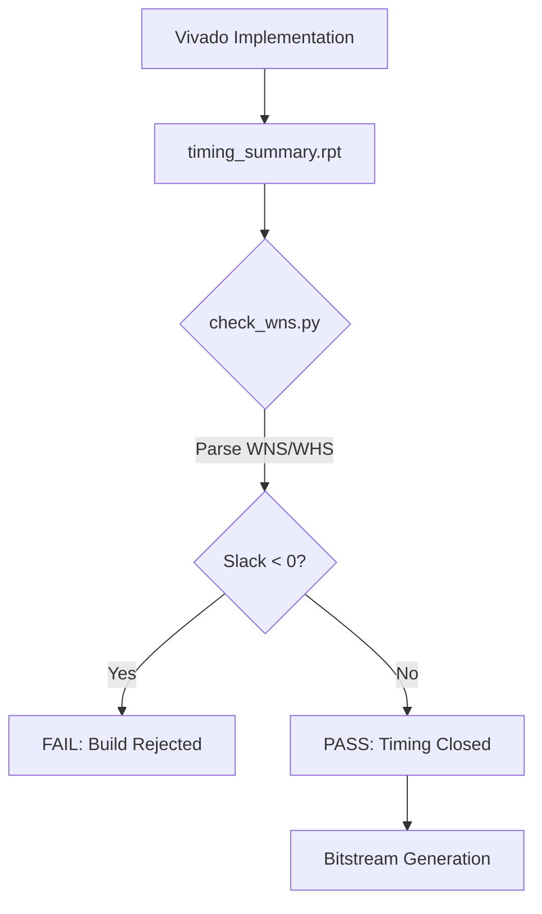
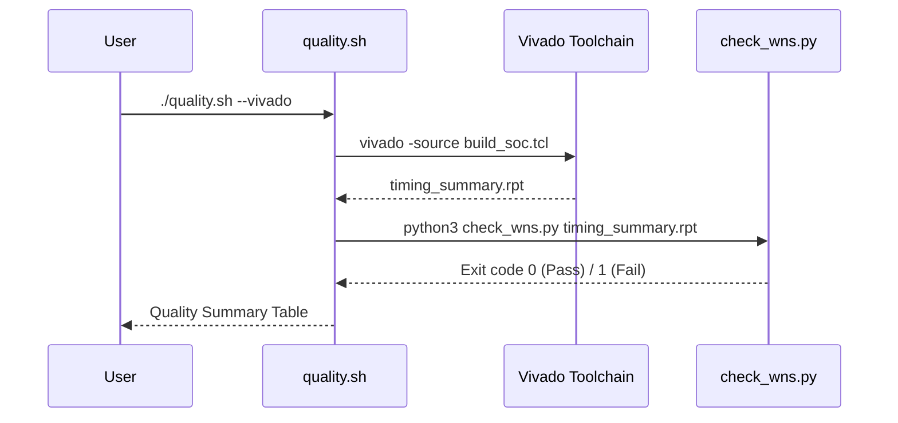

<details>
<summary>Relevant source files</summary>

The following files were used as context for generating this wiki page:

- [scripts/check_wns.py](scripts/check_wns.py)
- [AGENTS.md](AGENTS.md)
- [CLAUDE.md](CLAUDE.md)
- [README.md](README.md)
- [scripts/quality.sh](scripts/quality.sh)
- [CHANGELOG.md](CHANGELOG.md)
</details>

# Timing Analysis & WNS Checks

Timing analysis and Worst Negative Slack (WNS) checks ensure that the synthesized neuromorphic hardware meets the required temporal constraints for the Artix-7 FPGA target. Within the `silicon-hdl` project, timing analysis is a critical gate in the CI/CD pipeline, specifically within the Vivado-based synthesis and implementation workflows. It prevents timing violations from reaching physical hardware by failing the build if slack values are negative.

The primary mechanism for this check is a Python-based automation script that parses Vivado's `timing_summary.rpt`. This gate complements other quality checks such as the [Deduplication Guardian](#deduplication-verification) and Verilator-based RTL simulation.
Sources: [scripts/check_wns.py:1-5](scripts/check_wns.py#L1-L5), [AGENTS.md:15-32](AGENTS.md#L15-L32), [README.md:11-20](README.md#L11-L20)

## Timing Verification Workflow

Timing verification is integrated into the project's build and quality scripts. While Verilator is used for functional iteration, Vivado is reserved for synthesis and implementation where timing reports are generated.

### Automated Slack Validation
The script `scripts/check_wns.py` serves as a post-implementation gate. It extracts Slack metrics from Vivado reports and exits with a non-zero code if the design fails to close timing.



The diagram shows how timing analysis acts as a mandatory checkpoint after implementation and before bitstream generation.
Sources: [scripts/check_wns.py:73-95](scripts/check_wns.py#L73-L95), [AGENTS.md:52-54](AGENTS.md#L52-L54)

## Core Metrics Analyzed

The project focuses on two primary timing metrics to ensure stable operation on the Basys 3 hardware.

| Metric | Definition | Significance |
| :--- | :--- | :--- |
| **WNS** | Worst Negative Slack | Indicates setup time violations; determines if the clock frequency is too high for the logic depth. |
| **WHS** | Worst Hold Slack | Indicates hold time violations; ensures data remains stable long enough after a clock edge. |

Sources: [scripts/check_wns.py:13-25](scripts/check_wns.py#L13-L25), [scripts/check_wns.py:65-71](scripts/check_wns.py#L65-L71)

## Parsing Logic and Data Extraction

The `check_wns.py` script utilizes regular expressions to navigate the complex structure of Vivado timing reports. It supports multiple parsing strategies to handle variations in report formatting.

### Extraction Strategies
1.  **Design Timing Summary Block:** The primary target is the "Design Timing Summary" table, which contains high-level WNS and WHS values.
2.  **Fallback Row Parsing:** If the summary block is missing, the script searches for the first row containing WNS, TNS (Total Negative Slack) endpoints, and WHS.
3.  **Prose Slack Parsing:** As a final fallback, the script searches for textual labels like "Worst Negative Slack (WNS) :" in the report prose.

```python
def _parse_design_timing_summary(text: str) -> tuple[float | None, float | None]:
    # Prefer the Design Timing Summary block
    block = re.search(
        r"\|\s*Design Timing Summary\b.*?$"
        r".*?WNS\(ns\).*?WHS\(ns\).*?\n"
        r"[-\s|]+\n"
        r"\s*([-\d.]+)\s+([-\d.]+)\s+(\S+)\s+(\S+)\s+([-\d.]+)",
        text,
        re.DOTALL | re.MULTILINE,
    )
    if block:
        return float(block.group(1)), float(block.group(5))
```

Sources: [scripts/check_wns.py:13-25](scripts/check_wns.py#L13-L25), [scripts/check_wns.py:44-55](scripts/check_wns.py#L44-L55)

## Integration with Quality Suite

Timing checks are part of the broader quality assurance stack. The `scripts/quality.sh` entrypoint facilitates running these checks locally when Vivado is available.

### Quality Suite Sequence
When the `--vivado` flag is passed to `quality.sh`, the following sequence occurs:
1.  **Deduplication Guardian:** Checks for RTL module single-source-of-truth violations.
2.  **Verilator Simulation:** Runs functional testbenches for `LifNeuron`, `WeightRam`, etc.
3.  **Vivado Simulation:** Executes `scripts/sim_core.tcl`.
4.  **Vivado Build:** Executes `scripts/build_soc.tcl`, which triggers synthesis, implementation, and ultimately the timing report utilized by the WNS check.



The sequence illustrates the dependency of timing checks on the Vivado build process within the quality script.
Sources: [scripts/quality.sh:75-100](scripts/quality.sh#L75-L100), [AGENTS.md:12-25](AGENTS.md#L12-L25)

## Constraints and Hardware Target

The timing analysis is performed against specific hardware constraints defined for the **Digilent Basys 3 (Artix-7)**.
*  **Target Device:** `xc7a35tcpg236-1`
*  **Constraint Files:** `constraints/basys3.xdc` and `constraints/artix7_trainer.xdc`
*  **Application:** These constraints define the clock periods and I/O timing that the WNS check validates against.

Sources: [README.md:3-8](README.md#L3-L8), [README.md:28-40](README.md#L28-L40), [CLAUDE.md:46-48](CLAUDE.md#L46-L48)

## Conclusion

Timing Analysis & WNS Checks represent the final software-controlled gate before bitstream generation in the `silicon-hdl` project. By programmatically verifying that `WNS` and `WHS` are non-negative, the project ensures that the neuromorphic primitives, such as the `LifNeuron` and `SynapseRouter`, operate reliably within the physical limits of the Artix-7 FPGA. This automated approach is essential for maintaining design integrity as the monorepo evolves through iterative learning and AI-assisted design.
Sources: [scripts/check_wns.py:73-90](scripts/check_wns.py#L73-L90), [README.md:11-15](README.md#L11-L15)
